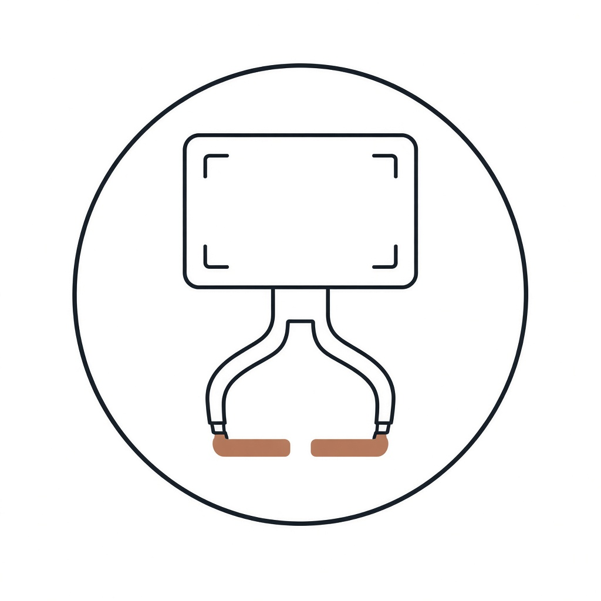

<p align="center">
  
</p>

<h1 align="center">EgoWhale</h1>

<p align="center">
  Egocentric video in. Dual-arm robot demonstrations out.
</p>

<p align="center">
  <a href="https://arxiv.org/abs/2608.02580"></a>
  
  
  
</p>

EgoWhale is a compact implementation of the [Ego2Robot](https://arxiv.org/abs/2608.02580) synthesis pipeline. It retargets a human episode onto a dual-arm robot, removes the person, and composites the robot back into the scene.

## Pipeline

| Stage | What it does | Output |
| --- | --- | --- |
| Retarget | Camera-frame parallel gripper, then smooth | `action/gripper.npz` |
| Segment | Person mask (SAM 3) | `visual/masks.npz` |
| Inpaint | Remove the person (ProPainter) | `visual/inpaint.mp4` |
| Depth | Scene depth (Depth Anything 3), scaled to meters | `visual/depth.npz` |
| Base + IK | Base pose and arm trajectory (cuRobo) | `action/base.json`, `action/ik.npz` |
| Approach | TrajOpt from the zero configuration to the first end-effector pose | `action/prefix.npz` |
| Composite | MuJoCo render; gripper hidden where the scene is closer | `visual/composite.mp4` |
| Curate | Frame checks, action statistics, then a VLM audit | `action/quality.json` |

Finished stages are skipped. Each stage is one class, so the same steps can later run as Ray actors.

## Run

An episode is an EgoDex HDF5 file with a sibling `.mp4`.

```bash
python -m egowhale path/to/episode.hdf5 [out_dir]
```

Outputs go to `outputs/<parent>/<stem>/` when `out_dir` is omitted.

Weights are local: `thirdparty/sam3`, `thirdparty/propainter`, and `thirdparty/da3` (`DA3-GIANT`). Rendering uses MuJoCo EGL.

The VLM audit calls Qwen when `EGOWHALE_VLM_API_KEY` is set. Optional overrides are `EGOWHALE_VLM_BASE_URL` and `EGOWHALE_VLM_MODEL`. Without a key, that audit is skipped.
