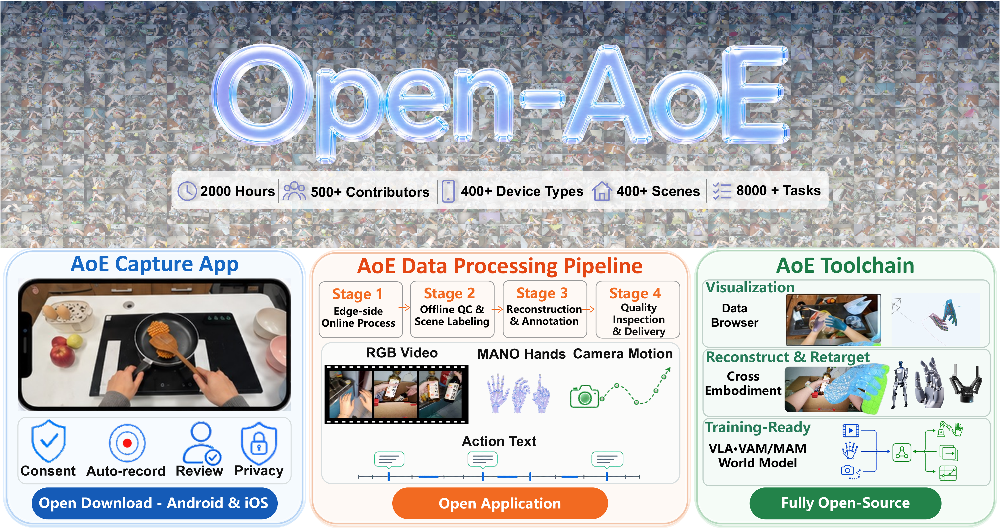
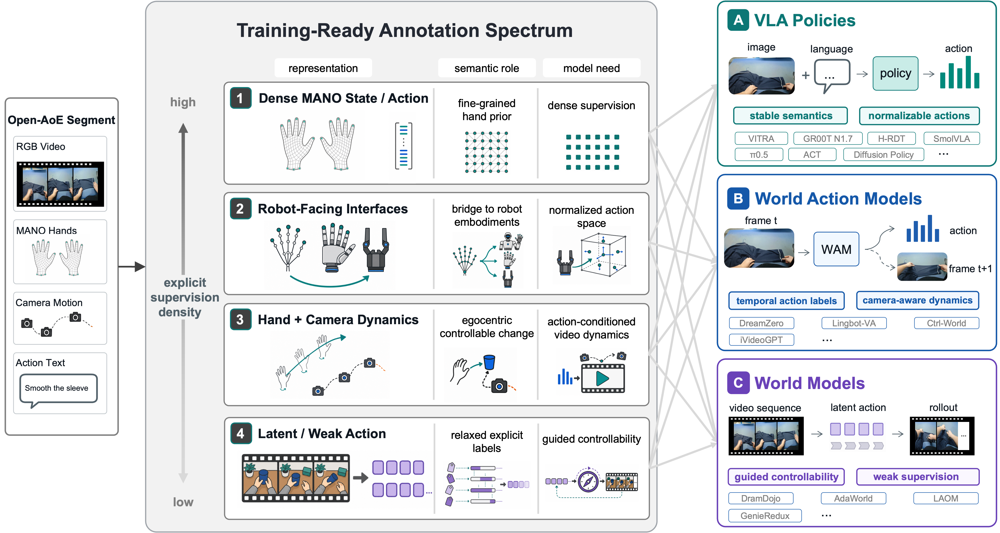
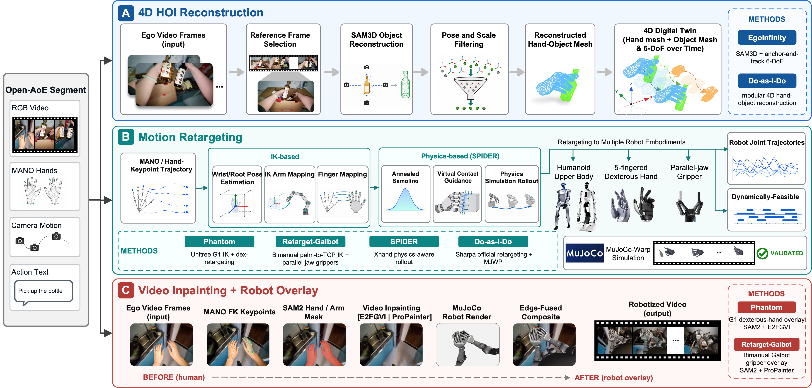
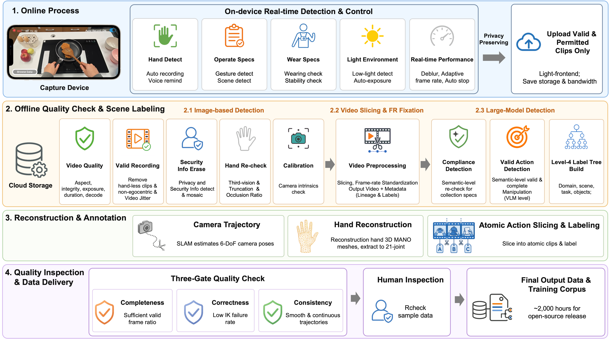

# Open-AoE

<p align="center">
  <strong>2,000 小时手机采集的第一视角操作数据<br>以及完整的 Data-to-Model 工具链</strong>
</p>

<p align="center">
  <a href="README.md">English</a> | 简体中文
</p>

<p align="center">
  <a href="https://arxiv.org/abs/2607.14183"></a>
  <a href="https://huggingface.co/datasets/inclusionAI/OpenAoE-2000h"></a>
  <a href="https://www.modelscope.cn/datasets/inclusionAI/OpenAoE-2000h"></a>
  
  <a href="https://dtcoder.antdigital.com/home"></a>
</p>

> [!TIP]
> 第一次接触 Open-AoE？建议先阅读[数据规格](open-aoe-2000h/README.md)，用 [AoE-Visualization](aoe-visualization/README.md) 渲染一个片段，再从 [AoE-Training-Ready](aoe-training-ready/README.md) 选择目标模型的训练配方。使用 [DTCoder](https://dtcoder.antdigital.com/home) 快速启动实验。

<p align="center">
  
</p>

Open-AoE 是完全使用消费级智能手机采集的大规模真实世界第一视角操作数据集，包含约 **2,000 小时**第一人称视频，以及时间同步的手部运动、相机运动和中英双语原子动作标注。本仓库进一步把这些信号连接到数据可视化、人机动作重映射、机器人回放和面向具体模型的训练配方。

## 获取发布资源

| 资源 | 入口 | 内容 |
|---|---|---|
| **技术报告** | [前往 arXiv 阅读](https://arxiv.org/abs/2607.14183) | 数据集设计、处理流程、数据分析、工具链与实验 |
| **Open-AoE-2000H** | [Hugging Face](https://huggingface.co/datasets/inclusionAI/OpenAoE-2000h) · [ModelScope](https://www.modelscope.cn/datasets/inclusionAI/OpenAoE-2000h) | 数据集文件和分发信息 |
| **数据规格** | [字段级文档](open-aoe-2000h/README.md) | 目录结构、字段定义、坐标系和自检说明 |
| **采集 APP** | 在各大应用市场搜索 **“具身智能数采助手”** | 手机端数据采集客户端 |

技术报告已发布在 [arXiv](https://arxiv.org/abs/2607.14183)。

## 按目标选择入口

| 我想要…… | 从这里开始 | 可以得到什么 |
|---|---|---|
| **了解一个数据片段里有什么** | [数据规格](open-aoe-2000h/README.md) | 理解视频、相机标定、MANO、相机轨迹和动作标注字段 |
| **先直观看数据，再决定怎么用** | [AoE-Visualization](aoe-visualization/README.md) | 生成包含双手、轨迹、动作和 3D 视图的端到端复核视频 |
| **训练 VLA 策略** | [LeRobot 配方](aoe-training-ready/lerobot/README_OPEN_AOE.md) · [GR00T N1.7](aoe-training-ready/gr00t_n1d7/README.md) · [H-RDT](aoe-training-ready/H-RDT/README.md) · [VITRA](aoe-training-ready/vitra/README.md) | 转换为模型所需的 state/action 语义并启动训练 |
| **训练世界模型或 Video Action Model** | [训练配方索引](aoe-training-ready/README.md) | 使用 DreamZero、LingBot-VA、Ctrl-World、iVideoGPT、GenieRedux、LAOM、AdaWorld 或 DreamDojo 适配 |
| **重建交互场景或将人类动作映射到机器人** | [AoE-Reconstruct-Retarget](aoe-reconstruct-retarget/README.md) | 重建交互资产，并生成机器人关节轨迹、仿真结果或 robotized video |
| **增加新模型或新机器人** | [贡献指南](CONTRIBUTING.md) | 按仓库结构和依赖规范添加自包含集成 |

## 快速开始：看懂一个数据片段

### 1. 克隆代码库

```bash
git clone https://github.com/ant-research/Open-AoE.git
cd Open-AoE
```

### 2. 下载数据

从 [Hugging Face](https://huggingface.co/datasets/inclusionAI/OpenAoE-2000h) 或 [ModelScope](https://www.modelscope.cn/datasets/inclusionAI/OpenAoE-2000h) 选择一个下载源，解压后找到一个 segment 目录。标准目录结构参见[数据规格](open-aoe-2000h/README.md)。

### 3. 渲染片段

部分可视化和重映射流程需要 MANO 模型文件。请先在 [MANO 官网](https://mano.is.tue.mpg.de/) 注册并下载 `MANO_RIGHT.pkl` 和 `MANO_LEFT.pkl`，再安装到仓库共享资源目录：

```bash
bash assets/mano/download_mano.sh \
  ~/Downloads/MANO_RIGHT.pkl \
  ~/Downloads/MANO_LEFT.pkl

cd aoe-visualization
pip install -r requirements.txt
python visualize.py --sample /path/to/open_aoe_segment
```

输出文件为 `output/<segment-name>/AoE_output_vis.mp4`，同步呈现第一视角视频、重建双手、手腕轨迹、原子动作、世界坐标运动和时间轴。EGL/OpenGL 环境要求和批量渲染方法参见[可视化指南](aoe-visualization/README.md)。

## 从原始数据到模型输入

每个 segment 是一条同步多模态记录，而不只是一个视频文件：

| 信号 | 主要文件 | 常见用途 |
|---|---|---|
| 原始与去畸变 RGB | `raw_video.mp4`、`raw_video_undistorted.mp4` | 视觉观测、视频建模和渲染叠加 |
| 相机元数据 | `video_info.json`、`undistorted_video_info.json` | 相机内参、畸变、设备信息、分辨率与帧率 |
| 相机运动 | `camera_traj.npz` 及 `hands.npz` 中的变换 | metric-scale 6-DoF 轨迹和世界/相机坐标变换 |
| 手部重建 | `hands.npz` | 双手逐帧 MANO 姿态、形状、根节点变换和有效性 |
| 原子动作 | `ego_action_annotation.json` | 时间对齐的左右手、动词、物体和双语动作描述 |

工具链再将这些同步信号转换为不同任务需要的表示：

| 阶段 | 组件 | 输出 |
|---|---|---|
| **洞察 / 复核** | [AoE-Visualization](aoe-visualization/README.md) | 每个 segment 一条复核视频，用于检查视觉效果和时序一致性 |
| **重建 / 重映射** | [AoE-Reconstruct-Retarget](aoe-reconstruct-retarget/README.md) | 重建资产、机器人轨迹、仿真验证和 robotized video |
| **转换 / 训练** | [AoE-Training-Ready](aoe-training-ready/README.md) | 面向具体模型的数据、动作、补丁、启动器和训练配方 |

> [!IMPORTANT]
> 训练数据转换本质上是**动作语义适配**，不只是文件格式转换。请先阅读[统一动作规格](aoe-training-ready/ACTION_SPEC.md)，再进入目标模型的 README。

## 训练配方地图

<p align="center">
  
</p>

| 目标 | 已提供的配方 | 推荐入口 |
|---|---|---|
| **VLA 策略** | ACT、Diffusion Policy、π0.5、SmolVLA、GR00T N1.7、H-RDT、VITRA | [Training-Ready 索引](aoe-training-ready/README.md) |
| **世界模型 / Video Action Model** | DreamZero、LingBot-VA、Ctrl-World、iVideoGPT | [Training-Ready 索引](aoe-training-ready/README.md) |
| **Latent Action / 世界模型** | GenieRedux、LAOM、AdaWorld、DreamDojo | [Training-Ready 索引](aoe-training-ready/README.md) |

每份配方都是自包含的，说明了上游仓库和验证 commit、数据转换方式、环境变量、训练命令、输出以及必要补丁。本仓库不会直接 vendor 上游项目或 checkpoint。

## 重建与重映射地图

<p align="center">
  
</p>

| 子项目 | 覆盖范围 | 主要能力 |
|---|---|---|
| [**Phantom**](aoe-reconstruct-retarget/phantom/) | Unitree G1 + Dex3 / Inspire | 臂部 IK、灵巧手重映射、MuJoCo 可视化和机器人叠加 |
| [**Retarget Galbot**](aoe-reconstruct-retarget/retarget_galbot/) | Galbot / Galaxea 双臂平台 | Palm-to-TCP IK、夹爪映射、egoview 合成和 LeRobot/Rerun 导出 |
| [**AoE Retarget Lab**](aoe-reconstruct-retarget/retarget-lab/) | EgoInfinity/G1、Do-as-I-Do/Sharpa、SPIDER/XHand | 外部方法适配、6-DoF 重建路线和 12-cell 对比矩阵 |

本仓库不包含第三方仓库、模型权重、机器人资产或生成视频。请按各子项目的安装指南获取外部依赖。

## 数据处理与质量控制

<p align="center">
  
</p>

1. **端侧采集控制**在上传前检查手部可见性、佩戴规范、光照、运动质量和设备状态。
2. **离线质量检查与场景标注**过滤无效或敏感内容，统一帧率，切分视频并生成场景/任务元数据。
3. **重建与标注**估计相机轨迹、重建 MANO 双手并生成原子动作片段。
4. **质量检查与交付**执行完整性、正确性和时序一致性检查，并加入人工复核。

## 仓库结构

```text
Open-AoE/
├── Open-AoE-tech-report.pdf  # 当前技术报告
├── open-aoe-2000h/           # 数据格式与字段级文档
├── aoe-visualization/        # 同步数据复核与渲染
├── aoe-reconstruct-retarget/ # 重建、重映射、回放与机器人叠加
├── aoe-training-ready/       # 模型适配、转换脚本、启动器与补丁
├── assets/mano/              # MANO 共享配置脚本；模型文件不纳入 Git
├── docs/                     # 总览图与流水线图
├── CONTRIBUTING.md
├── LEGAL.md
└── LICENSE
```

## 为什么选择 Open-AoE？

- **智能手机采集：** 消费级设备让真实世界第一视角采集更易参与、更容易规模化。
- **面向操作学习的同步信号：** 标定后的 RGB 与相机运动、MANO 手部重建、有效性标记和原子动作保持同步。
- **完整 Data-to-Model 路径：** 仓库覆盖数据洞察、动作重映射、表示转换和面向具体模型的训练集成。
- **模块化、可扩展：** 各组件可以独立使用，新机器人本体或模型配方也能作为自包含集成加入。

## 引用

技术报告已发布在 [arXiv](https://arxiv.org/abs/2607.14183)。

## 联系我们

- **数据加工管线申请：** [open.aoe@gmail.com](mailto:open.aoe@gmail.com)
- **产业合作申请：** [kaile.zk@antgroup.com](mailto:kaile.zk@antgroup.com)

## 参与贡献

欢迎贡献新的机器人本体、重建或重映射后端、可视化能力、数据转换器和训练配方。提交 PR 前请阅读 [CONTRIBUTING.md](CONTRIBUTING.md)。

## 许可证与第三方组件

本仓库原创代码以 [Apache License 2.0](LICENSE) 发布。数据集分发条款、模型权重、机器人资产、MANO 文件和第三方组件可能采用不同许可证；重新分发或商业使用前请阅读 [LEGAL.md](LEGAL.md) 和对应子项目 README。

## 致谢

Open-AoE 由 AoE 社区共同建设。我们诚挚感谢以下来自企业、高校与科研机构的参与者。

### 数据集与可视化贡献

- **新加坡国立大学（National University of Singapore）：** Qingze Guan
- **中国科学院大学（University of Chinese Academy of Sciences）：** Zhengxing Wu
- **蚂蚁集团数字科技（Ant Digital Technology, Ant Group）：** Zishuo Li、Wanke Zhan、Yang Sun、Zhiyi Huang、Zitong Shan

### 开源代码、工具链与实验贡献

- **浙江大学（Zhejiang University）：** Jiadong Hong
- **香港大学（The University of Hong Kong）：** Zhenchao Jin、Yushi Feng
- **香港科技大学（广州）（The Hong Kong University of Science and Technology (Guangzhou)）：** Taowen Wang
- **北京智源人工智能研究院（Beijing Academy of Artificial Intelligence）：** You Liu、Yibo Wang
- **中国科学院大学（University of Chinese Academy of Sciences）：** Yifan Yang
- **香港科技大学（The Hong Kong University of Science and Technology）：** Hao Cheng
- **蚂蚁集团数字科技（Ant Digital Technology, Ant Group）：** Bowen Yang、Changtao Miao、Zhaowen Zhou、Man Luo

同时感谢所有数据贡献者、项目维护者，以及为本次发布提供基础的上游开源与研究社区。
