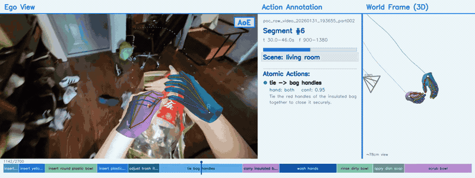

# AoE-Visualization

Self-contained visualizer for the **Open-AoE** ego-centric delivery. It re-renders
the MANO hand reconstruction and overlays the action annotations onto the video,
producing a single end-to-end review video per sample.

The results visualized here are produced by the AoE processing pipeline
(visual-SLAM camera trajectory estimation + parametric MANO hand reconstruction).
The MANO→keypoint conversion and on-frame overlay style follow the reference
keypoint convention, so the keypoint overlay matches the delivery convention
exactly.

<p align="center">
  
</p>
<p align="center"><em>预期输出示例：ego 视频 + MANO 手部渲染 + 动作标注 + 3D 世界帧 + 时间轴</em></p>

## What it renders

A single combined frame contains:

1. **Ego video** (undistorted) with:
   - **MANO hand mesh**: the smooth-shaded, lit 778-vertex hand surface (soft
     purple = left, steel blue = right), drawn under the skeleton. Rendered with a
     high-quality offscreen OpenGL renderer when available, otherwise a pure-NumPy
     shaded mesh (see *Hand-mesh rendering*).
   - **Camera-frame MANO keypoints**: the 21-keypoint OpenPose hand skeleton on
     top of the mesh, per-finger colours (thumb=orange, index=green, middle=blue,
     ring=magenta, little=cyan), wrist labelled `L`/`R`.
   - **Future wrist-trajectory trails**: the next 30 frames of each hand's wrist,
     transformed into the *current* frame's camera and projected as a fading
     dotted trail (left=purple, right=amber).
   - An **`AoE` wordmark** in the top-right corner.
2. **Annotation info panel** (white/blue theme): segment id, scene, time/frame
   range, progress bar, and the atomic actions (verb → object, hand, confidence,
   description). All text is wrapped to the panel width so nothing clips.
3. **World-frame 3D panel**: both hands' shaded MANO mesh + 21-keypoint skeleton
   in the world coordinate frame from a fixed viewpoint, following the hands, with
   recent wrist trails and the camera position.
4. **Bottom timeline scrubber**: every annotation segment as a coloured block
   (a curated blue → teal → indigo → periwinkle palette) along the full duration,
   labelled with its action `verb object` when the block is wide enough (narrow
   blocks are left unlabelled), plus a moving playhead.

A unified **top title bar** labels the three sections ("Ego View", "Action
Annotation", "World Frame (3D)") on a common baseline, with a blue separator
between the annotation and world panels. The panels and timeline use a light
**white/blue** theme for a clean, high-contrast look.

Each sample produces a single video file, `AoE_output_vis.mp4`.

## MANO re-rendering (how it works)

`hands.npz` only stores MANO **parameters** (`pred_hand_pose`, `pred_betas`,
`pred_rot`/`pred_trans` world root, `pred_rot_cam`/`pred_trans_cam`, per-frame
`R_w2c`/`t_w2c`/`R_c2w`/`t_c2w`, `pred_valid`, `focal`), so the hand mesh/joints
must be **re-rendered** via MANO forward kinematics:

1. Run MANO FK with the **world** root params → 16 skeleton joints + 5 fingertips,
   reordered to the 21-keypoint **OpenPose** hand order.
   The left hand applies the well-known `shapedirs[:,0,:] *= -1` fix.
2. **World frame**: these `joints_world` are plotted directly in 3D.
3. **Camera frame**: `joints_cam = R_w2c @ joints_world + t_w2c` (rigid transform,
   following the reference keypoint convention — this avoids the non-linear LBS
   offset of re-running MANO with the camera-space root).
4. **2D projection**: pinhole `u = fx·x/z + cx`, with `fx = fy = focal` and the
   principal point at the image centre, onto the **undistorted** video.

### Self-contained MANO assets

All MANO dependencies load **only from inside this folder**:

- `assets/mano/MANO_RIGHT.npz`, `assets/mano/MANO_LEFT.npz` — the MANO model
  tensors (`v_template`, `shapedirs`, `posedirs`, `J_regressor`, `weights`,
  `kintree_table`, faces) as **plain NumPy** arrays. **Not bundled** — generate
  from .pkl files via `scripts/convert_mano_pkl_to_npz.py`. Run
  `assets/mano/download_mano.sh` from the repo root first.
- `aoe_vis/mano_layer.py` — a pure-NumPy MANO LBS forward pass (no deep-learning
  framework or other heavy dependencies required at runtime).

**Provenance**: the `.npz` files were converted once from the standard MANO hand
model files into a dependency-free NumPy format
(`scripts/convert_mano_pkl_to_npz.py`), so no special libraries are needed at
runtime. The MANO model is © MPI and subject to the
[MANO license](https://mano.is.tue.mpg.de/license.html); it is vendored here only
for visualization of AoE data.

## Hand-mesh rendering

The MANO surface in the camera view is rendered to match the reference
high-quality path, which uses a **headless OpenGL renderer** to draw
**smooth-shaded, lit** hand meshes (no wireframe), one solid colour per hand —
a soft purple for the left hand and a steel blue for the right.

To stay self-contained and composite cleanly into the multi-panel layout, this
release reproduces that link with its own offscreen OpenGL renderer
(`aoe_vis/gl_render.py`, using `pyrender` via EGL). It faithfully reproduces the
reference shading: the exact per-hand colours, smooth per-vertex normals, and the
reference two-light Lambert model baked into per-vertex colours (`aoe_vis/shading.py`),
composited through an OpenCV-intrinsics camera (`fx=fy=focal`, principal point at
the image centre).

**The OpenGL renderer is the required rendering backend** — the approved
director-colored, smooth-shaded mesh look depends on it. The same baked shading
is reused by the world-frame 3D panel so both views match.

- **Required (GL path):** `pyrender` + `trimesh` + `PyOpenGL`, plus a working
  **EGL/OpenGL offscreen context** (typically a GPU box). This is the intended
  output.
- **Degraded fallback:** if the GL context cannot be created, the tool falls back
  to a pure-NumPy painter's mesh (`aoe_vis/mesh.py`) so it still produces a video
  without crashing — but this is a *lower-quality, flat-shaded* path and is **not**
  the approved look. Treat it only as a safety net.

## Install

```bash
pip install -r requirements.txt   # numpy, opencv-python, pyrender, trimesh, PyOpenGL
```

Requirements (all needed for the intended output):

| Dependency | Role |
|------------|------|
| `numpy`, `opencv-python` | numerics, video/image I/O and drawing |
| `pyrender`, `trimesh`, `PyOpenGL` | required OpenGL hand-mesh backend |
| EGL / OpenGL drivers (system) | offscreen GL context (GPU box); set via `PYOPENGL_PLATFORM=egl` automatically |
| `ffmpeg` (system, optional) | H.264 transcode of the output; falls back to the OpenCV mp4v writer if absent |

Tested with Python 3.10, OpenCV 4.x, NumPy 1.x, pyrender 0.1.45. The GL backend
requires a machine with working EGL/OpenGL (GPU). `matplotlib` is **not** required
(the release produces only the video).

## Usage

The CLI takes only an input and an output location; all rendering options use
sensible baked-in defaults.

```bash
# one sample -> output/<name>/AoE_output_vis.mp4
python visualize.py --sample /path/to/delivery/data/<sample_name>

# whole delivery directory
python visualize.py --data_dir /path/to/delivery/data --output_dir ./output
```

| Flag | Default | Meaning |
|------|---------|---------|
| `--sample` / `--data_dir` | — | single sample dir / dir of samples (mutually exclusive) |
| `--output_dir` | `./output` | output root |

## Outputs

```
output/<sample_name>/
└── AoE_output_vis.mp4   # combined visualization (the only per-sample output)
```

## Layout

```
aoe-visualization/
├── visualize.py             # CLI entry
├── requirements.txt
├── README.md
├── assets/mano/             # vendored MANO model (pure-numpy npz)
│   ├── MANO_RIGHT.npz
│   └── MANO_LEFT.npz
├── scripts/
│   └── convert_mano_pkl_to_npz.py   # one-time pkl -> npz converter (provenance)
└── aoe_vis/
    ├── mano_layer.py        # pure-numpy MANO forward kinematics (joints + mesh)
    ├── keypoints.py         # MANO -> 21 keypoints / mesh, projection, on-frame drawing
    ├── shading.py           # reference two-light Lambert model (baked per-vertex)
    ├── gl_render.py         # offscreen OpenGL MANO mesh (required backend)
    ├── mesh.py              # pure-numpy shaded MANO mesh (degraded fallback)
    ├── overlays.py          # info panel, header bar, AoE wordmark, timeline scrubber
    ├── trajectory.py        # future wrist trails, world-frame panel
    ├── sample.py            # sample path resolution
    └── render.py            # end-to-end renderer
```

## Notes & limitations

- The camera-frame MANO overlay (mesh + keypoints) is geometrically correct on the
  **undistorted** video (`raw_video_undistorted.mp4`), which is the base canvas.
- Hands are only drawn on frames where `pred_valid` is set for that hand.
- The world-frame panel uses a follow-the-hands view with a fixed metric scale
  (so the 3D pose stays visible); the camera frustum and wrist trails convey
  global motion.
- MANO FK runs on CPU in NumPy (~5 s for 2700 frames × 2 hands for keypoints);
  the per-frame mesh rendering adds the dominant cost. The GL renderer is fast on
  a GPU; the NumPy fallback is slower, so full-length rendering of a 2700-frame
  sample is on the order of several minutes.
