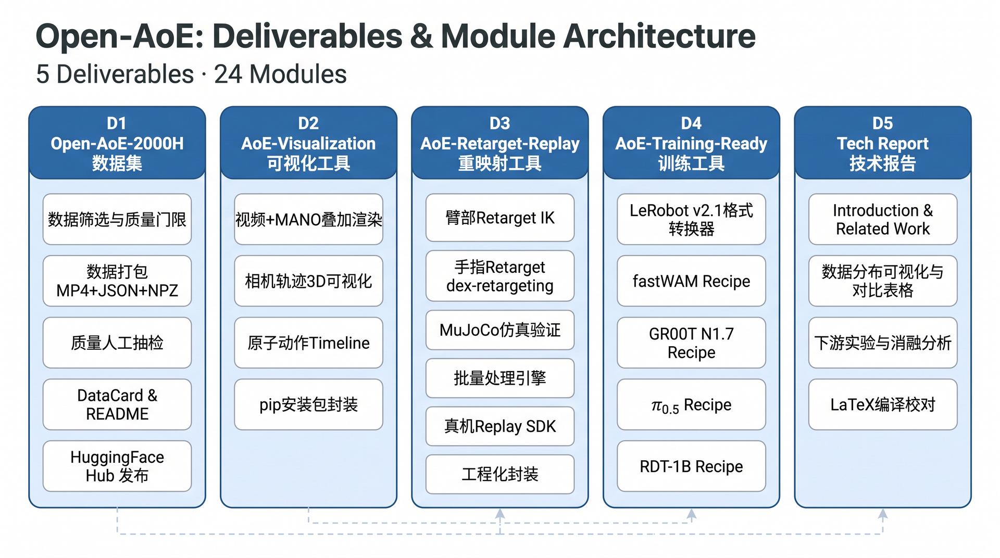

# Open-AoE 模块分工文档

**版本**: v1.0  
**日期**: 2026-06-08  
**目标发布**: WAIC 2026-07 中下旬  
**文档目的**: 呈现 Open-AoE 全部交付物的模块构成和工作量，供参与者分工和进度追踪

---

## 一、项目交付物总览

Open-AoE 最终对外发布 **5 大交付物**，共计 **24 个功能模块**。

| 编号 | 交付物 | 模块数 | 当前完成度 | 发布形态 |
|------|--------|--------|-----------|---------|
| D1 | Open-AoE-2000H 数据集 | 5 | 0% | HuggingFace Dataset |
| D2 | AoE-Visualization 可视化工具 | 4 | 0% | pip 包 + GitHub |
| D3 | AoE-Retarget-Replay 重映射工具 | 6 | 50% | Python 包 + GitHub |
| D4 | AoE-Training-Ready 训练工具 | 5 | 30% | Python 脚本 + GitHub |
| D5 | Tech Report 技术报告 | 4 | 20% | LaTeX → PDF (4页) |

---

## 二、架构框架图



**依赖关系**：D1（数据集）是所有其他交付物的上游依赖。D2/D3/D4 的实验结果汇入 D5（Tech Report）。

```
D1 数据集 ──→ D2 可视化 ──────→ D5 Tech Report（数据分布图表）
    │                                    ↑
    ├──────→ D3 重映射 ──────→ D5 Tech Report（Replay实验）
    │                                    ↑
    └──────→ D4 训练工具 ────→ D5 Tech Report（模型实验）
```

**关键路径**: D1 → D4 → D5（数据筛选 → 模型训练实验 → 报告撰写）

---

## 三、各交付物模块详解

### D1: Open-AoE-2000H 数据集

> **一句话**: 开源 2000 小时带原子动作描述和 MANO 标注的 ego-centric 操作数据。

| 模块编号 | 模块名称 | 工作内容 | 预估人天 | 前置依赖 | 当前状态 |
|----------|---------|---------|---------|---------|---------|
| D1.1 | 筛选门限定义 | 定义 pred_valid 覆盖率（>80%）、IK failure rate（<5%）、相机轨迹连续性（<10cm/帧）三项门限；在 sample_data 上验证门限合理性 | 2 | 无 | 🔴 |
| D1.2 | 数据筛选执行 | 编写并运行筛选脚本，从全量数据池中筛出符合门限的 2000H 子集 | 3 | D1.1 | 🔴 |
| D1.3 | 质量人工抽检 | 5% 随机采样人工复审，检查标注准确性（动作边界 IoU、MANO 贴合度、Caption 语义） | 3 | D1.2 | 🔴 |
| D1.4 | 数据打包发布 | 按 `raw_{id}_seg_{id}/` 结构打包 MP4+JSON+NPZ；撰写 DataCard 和 README；上传 HuggingFace Hub | 3 | D1.3 | 🔴 |
| D1.5 | 数据统计脚本 | 编写分布统计脚本：场景/动作/时长/采集人/机型分布，输出 JSON + 图表（供 D2 和 D5 使用） | 2 | D1.2 | 🔴 |

**D1 合计**: ~13 人天

**数据格式速查**:
```
raw_{collector_id}_seg_{segment_id}/
├── raw_video.mp4                   # 去畸变 ego 视频
├── video_info.json                 # 设备信息 + 相机内参
├── ego_annotation/
│   └── ego_action_annotation.json  # 原子动作切分 + 中英双语 caption
└── ego_process/
    ├── hands.npz                   # MANO 手部重建 (HaWoR)
    └── camera_traj.npz             # 相机轨迹 (MegaSAM)
```

---

### D2: AoE-Visualization 可视化工具

> **一句话**: 基于 Rerun 的数据浏览器，方便用户直观理解 AoE 数据。

| 模块编号 | 模块名称 | 工作内容 | 预估人天 | 前置依赖 | 当前状态 |
|----------|---------|---------|---------|---------|---------|
| D2.1 | 视频 + MANO 叠加渲染 | 加载 raw_video.mp4 + hands.npz，在 Rerun 中渲染 ego 视频帧并叠加 MANO 手部网格 | 3 | D1.4 (sample_data 即可先行) | 🔴 |
| D2.2 | 相机轨迹 3D 可视化 | 加载 camera_traj.npz，在 Rerun 3D 空间中绘制相机运动轨迹和朝向 | 2 | 同上 | 🔴 |
| D2.3 | 原子动作 Timeline | 加载 ego_action_annotation.json，在时间轴上渲染动作片段、双语 caption、起止时间 | 2 | 同上 | 🔴 |
| D2.4 | 工程化封装 | `pyproject.toml` + CLI 入口 + `pip install aoe-visualization`；撰写 README 和 demo 截图 | 2 | D2.1-D2.3 | 🔴 |

**D2 合计**: ~9 人天

**技术栈**: Python, `rerun-sdk>=0.21`, `numpy`, `opencv-python`, `trimesh`（MANO 网格渲染）

---

### D3: AoE-Retarget-Replay 重映射工具

> **一句话**: 将 AoE 人类数据转换为机器人可执行的关节轨迹，并在真机上 replay 验证。

| 模块编号 | 模块名称 | 工作内容 | 预估人天 | 前置依赖 | 当前状态 |
|----------|---------|---------|---------|---------|---------|
| D3.1 | 臂部 Retarget | 基于现有 `ant_aoe_retarget_to_g1.py`，将 camera_traj 映射到 G1 双臂 7-DoF 关节角 | 1 | 无 | 🟡 80% |
| D3.2 | 手指 Retarget | 集成 dex-retargeting 库，编写 Inspire 5-finger Hand 的 URDF 配置文件，将 MANO 手指关键点映射到 6-DoF/手 | 4 | D3.1 | 🔴 |
| D3.3 | MuJoCo 仿真验证 | 产品化 `triple_play.py`：2×2 可视化（ego 视频 / MANO overlay / MuJoCo 渲染 / 关节轨迹图） | 2 | D3.1, D3.2 | 🟡 有原型 |
| D3.4 | 批量处理引擎 | 支持对整个数据集目录批量 retarget，多进程并行，进度条，错误日志 | 2 | D3.1-D3.3 | 🔴 |
| D3.5 | 真机 Replay | 在 Unitree G1 + Inspire Hand 上执行 retarget 轨迹；录制演示视频（3-5 个任务） | 3 | D3.1-D3.3 | 🔴 |
| D3.6 | 工程化封装 | CLI 入口 + README + 使用教程 + URDF 配置文件 | 2 | D3.1-D3.5 | 🔴 |

**D3 合计**: ~14 人天

**目标 Joint Space**: 28D — `[L_ARM(7), R_ARM(7), L_HAND(6), R_HAND(6), PAD(2)]`

**核心依赖**:
- `dex-retargeting` (1,034⭐) — 手指优化映射
- `mujoco` — 仿真验证
- 推荐升级路径: Phase 2 集成 GMR (2,306⭐) 做全身 retarget

---

### D4: AoE-Training-Ready 训练工具

> **一句话**: 提供格式转换器和 training recipe，让 AoE 数据可直接训练主流模型。

| 模块编号 | 模块名称 | 工作内容 | 预估人天 | 前置依赖 | 当前状态 |
|----------|---------|---------|---------|---------|---------|
| D4.1 | LeRobot 格式转换器 | 完善 `retarget_npz_to_lerobot.py`：AoE NPZ（28D joint + ego 图像 + caption）→ LeRobot v2.1 Dataset（Parquet + MP4） | 3 | D3.1-D3.2 | 🟡 60% |
| D4.2 | fastWAM Recipe | 将已验证的 fastWAM multihead 训练配置文档化：config yaml + 训练脚本 + 训练日志 + README | 1 | D4.1 | 🟡 已验证 |
| D4.3 | GR00T N1.7 Recipe | 编写 `lerobot_to_groot.py` 格式适配器；提供 Isaac-GR00T 微调配置（基于 FLARE 框架） | 3 | D4.1 | 🔴 |
| D4.4 | π₀.₅ (OpenPI) Recipe | 编写 `lerobot_to_openpi.py` 格式适配器；提供 OpenPI flow-matching 微调配置 | 4 | D4.1 | 🔴 |
| D4.5 | 工程化封装 | 统一 CLI 入口 `aoe-training-ready convert --model {model}`；模型选择指南 README | 2 | D4.2-D4.4 | 🔴 |

**D4 合计**: ~13 人天

**架构设计**:
```
AoE NPZ → retarget_npz_to_lerobot.py → LeRobot v2.1（数据中枢）
                                            │
                    ┌───────────────────────┼────────────────────┐
                    ▼                       ▼                    ▼
              fastWAM Recipe         GR00T Recipe          π₀.₅ Recipe
              (✅ 已验证)           (有验证基础)          (待打通)
```

**已验证数据**: fastWAM multihead — Step 100, Loss 0.523; GR00T N1.5 + FLARE — Close Laptop SR 45%→95%

---

### D5: Tech Report 技术报告

> **一句话**: 4 页短报告（或 AoE v3 章节），包含数据分布洞察和轻量实验。

| 模块编号 | 模块名称 | 工作内容 | 预估人天 | 前置依赖 | 当前状态 |
|----------|---------|---------|---------|---------|---------|
| D5.1 | Introduction + Related Work | 基于调研报告 Report1 的 Related Work 初稿，补充 Open-AoE 定位叙事 | 2 | 无 | 🟡 初稿完成 |
| D5.2 | 数据分布可视化 | 利用 D1.5 的统计结果，制作场景/动作/时长/机型分布图表；设计 Table 1（采集范式对比）+ Table 2（数据集横向对比） | 3 | D1.5 | 🔴 |
| D5.3 | 实验章节 | 整理已有真机实验数据（Table 3: SR/PSR）；补充 Data Recipe 消融曲线；补充 Retarget-Replay 验证 | 3 | D3.5, D4.2-D4.4 | 🟡 有基础数据 |
| D5.4 | 编译校对发布 | LaTeX 编译调试；全文校对；生成 camera-ready PDF | 2 | D5.1-D5.3 | 🔴 |

**D5 合计**: ~10 人天

**LaTeX 结构** (已搭建):
```
report/
├── main.tex                        # 主文件
├── references.bib                  # 参考文献 (26 条)
├── sections/
│   ├── 1_introduction.tex          # 已完成初稿
│   ├── 2_related_work.tex          # 已完成初稿
│   ├── 3_dataset.tex               # 已完成初稿
│   ├── 4_toolchain.tex             # 已完成初稿
│   ├── 5_experiments.tex           # 已完成初稿（含实验表格）
│   └── 6_conclusion.tex            # 已完成初稿
├── figures/                        # 待补充数据分布图
└── tables/                         # 复杂表格源文件
```

---

## 四、工作量汇总与优先级排序

### 总工作量

| 交付物 | 人天 | 优先级 | 理由 |
|--------|------|--------|------|
| D1 数据集 | 13 | 🔴 P0 | 所有交付物的上游依赖，阻塞关键路径 |
| D3 重映射工具 | 14 | 🔴 P0 | D4 格式转换器依赖 retarget 输出 |
| D4 训练工具 | 13 | 🟠 P1 | 核心差异化价值，D5 实验章节依赖 |
| D5 Tech Report | 10 | 🟠 P1 | WAIC 发布必须项 |
| D2 可视化工具 | 9 | 🟡 P2 | 重要但不在关键路径上 |
| **合计** | **59** | — | — |

### 建议排期（6 周倒推）

```
Week 1 (06-09 ~ 06-15)   D1.1 筛选门限定义 + D3.2 Inspire Hand URDF
Week 2 (06-16 ~ 06-22)   D1.2 数据筛选 + D3.1/D3.3 Retarget 完善
Week 3 (06-23 ~ 06-29)   D1.3-D1.4 质量检查+打包 + D4.1 LeRobot 转换器
Week 4 (06-30 ~ 07-06)   D4.2-D4.4 三个 Recipe + D2.1-D2.3 可视化
Week 5 (07-07 ~ 07-13)   D5.2-D5.3 报告图表+实验 + D3.5 真机 Replay
Week 6 (07-14 ~ 07-20)   D5.4 报告校对 + 全部工程化封装 + WAIC 发布
```

---

## 五、分工认领表

> **填写方式**: 各参与者在"负责人"列填写自己的名字，更新状态列。

| 模块编号 | 模块名称 | 负责人 | 计划开始 | 计划完成 | 实际状态 |
|----------|---------|--------|---------|---------|---------|
| D1.1 | 筛选门限定义 | | | | 🔴 待认领 |
| D1.2 | 数据筛选执行 | | | | 🔴 待认领 |
| D1.3 | 质量人工抽检 | | | | 🔴 待认领 |
| D1.4 | 数据打包发布 | | | | 🔴 待认领 |
| D1.5 | 数据统计脚本 | | | | 🔴 待认领 |
| D2.1 | 视频+MANO叠加 | | | | 🔴 待认领 |
| D2.2 | 相机轨迹3D | | | | 🔴 待认领 |
| D2.3 | 原子动作Timeline | | | | 🔴 待认领 |
| D2.4 | 工程化封装 | | | | 🔴 待认领 |
| D3.1 | 臂部Retarget | | | | 🟡 80% |
| D3.2 | 手指Retarget | | | | 🔴 待认领 |
| D3.3 | MuJoCo仿真验证 | | | | 🟡 有原型 |
| D3.4 | 批量处理引擎 | | | | 🔴 待认领 |
| D3.5 | 真机Replay | | | | 🔴 待认领 |
| D3.6 | 工程化封装 | | | | 🔴 待认领 |
| D4.1 | LeRobot格式转换器 | | | | 🟡 60% |
| D4.2 | fastWAM Recipe | | | | 🟡 已验证 |
| D4.3 | GR00T Recipe | | | | 🔴 待认领 |
| D4.4 | π₀.₅ Recipe | | | | 🔴 待认领 |
| D4.5 | 工程化封装 | | | | 🔴 待认领 |
| D5.1 | Intro + Related Work | | | | 🟡 初稿完成 |
| D5.2 | 数据分布可视化 | | | | 🔴 待认领 |
| D5.3 | 实验章节 | | | | 🟡 有基础 |
| D5.4 | 编译校对发布 | | | | 🔴 待认领 |

---

## 六、风险项

| 风险 | 影响范围 | 缓解措施 |
|------|---------|---------|
| Inspire Hand 无 URDF 配置文件 | D3.2 阻塞 → D3 全链路 | 联系硬件团队获取 URDF，或自行测量建模 |
| 数据筛选门限过严导致不足 2000H | D1 规模缩水 | 先跑一轮统计确认候选池大小，再定门限 |
| π₀.₅ API 频繁更新 | D4.4 适配器失效 | 锁定 OpenPI 特定 commit/版本 |
| 真机实验时间窗口有限 | D3.5, D5.3 | 提前预约 G1 机器人实验时间 |
| WAIC DDL 紧张（6 周） | 全局 | 按 P0>P1>P2 优先级，P2 可延至外滩大会 |
