# Open-AoE 数据分布分析报告

> **数据版本**：20260525 交付批次  
> **分析日期**：2026-06-10  
> **数据规模**：1,000 segments / 12,141 actions / 17.73 hours  
> **统计来源**：`openaoe_statistics.json` + `visualize_data_distribution.py` 生成图表

---

## 总览

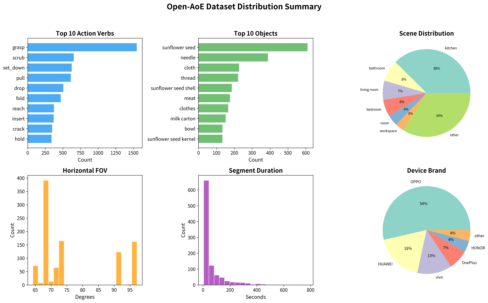

本报告对当前批次 Open-AoE 数据的各维度分布进行系统性审查，从开源数据集质量标准出发，识别分布健康度并给出优化建议。评估维度包括：**场景、动作动词、被操作物体、采集设备、采集者、手部使用、视频参数（分辨率/帧率/时长/FOV）、动作密度**。

### 核心指标速览

| 指标 | 数值 |
|------|------|
| 视频片段数 | 1,000 |
| 原子动作总数 | 12,141 |
| 总时长 | 17.73 小时 |
| 独立动词数 | 117 |
| 独立物体数 | 1,362 |
| 场景类别数 | 74 |
| 采集设备型号数 | 25 |
| 采集者人数 | 157 |

---

## 一、场景分布

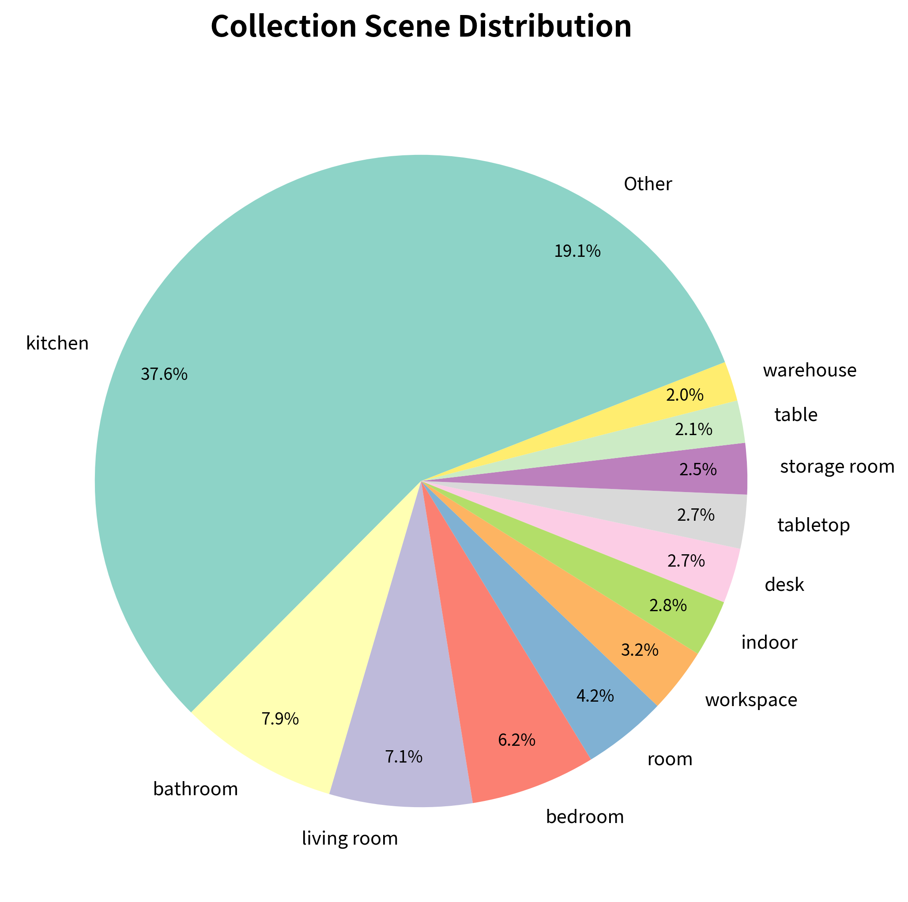

### 现状

场景标签共 74 类，但动作分布**极度集中于 kitchen（4,559 次，约 37.6%）**，其次为 bathroom（960）、living room（859+97=956）、bedroom（751）。仅 kitchen + bathroom + living room + bedroom 四大场景就占据了总动作量的 **59.4%**。

同时存在**标签碎片化**问题：同一语义场景被标注为多种变体（如 `living room` / `living_room`、`car interior` / `car_interior` / `car`、`outdoor` / `outdoor yard` / `outdoor courtyard` / `outdoor wash area` / `outdoor washing area` / `outdoor utility area`），实际独立场景数远低于 74。

### 健康度评价：⚠️ 需要优化

- **问题 1 — 头部过度集中**：kitchen 占比过高，会导致模型在非厨房场景下的泛化能力不足。作为对比，Ego4D 的场景分布中厨房占比约 20-25%，本数据集几乎是其 1.5 倍。
- **问题 2 — 标签不规范**：同义场景存在多种写法，如果不做归一化，下游用户在按场景筛选/分析时会产生困惑。
- **问题 3 — 户外场景严重不足**：所有 outdoor 相关场景（含 courtyard / yard / balcony / garage / sidewalk / driveway / backyard 等 14 个标签）合计 434 次动作（仅占 3.6%），而真实具身操作中户外场景（园艺、工地、快递分拣等）占比应更高。

### 优化建议

1. 下一批采集**定向增加非厨房场景比重**，特别是 workshop/garage/outdoor 等工业及户外场景
2. 建立**场景标签归一化映射表**，合并同义标签，收敛到 ~30 个标准类别
3. 考虑引入 Ego4D 的 scenario taxonomy 作为对齐参考

---

## 二、动作动词分布

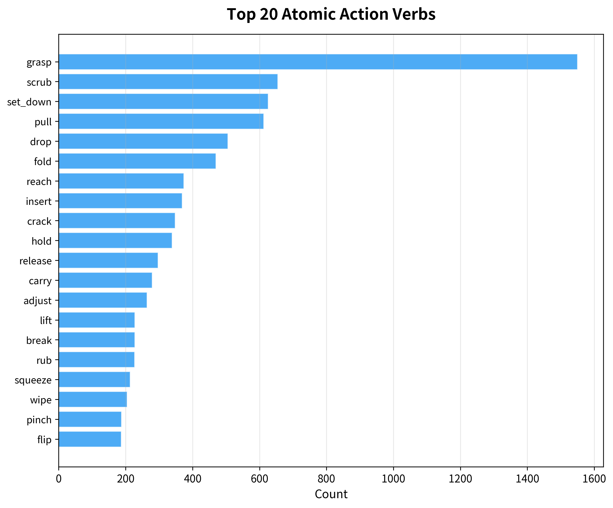

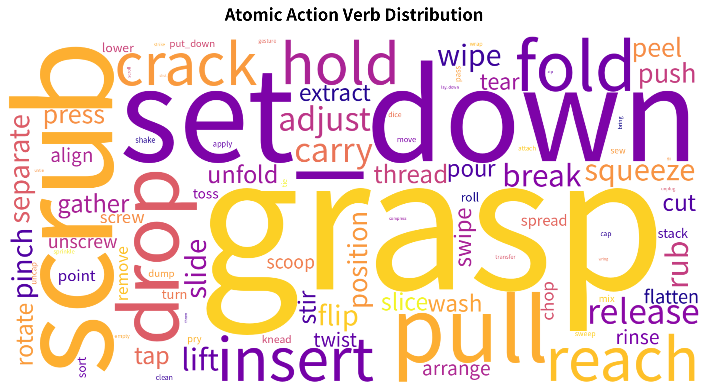

### 现状

117 个独立动词中，`grasp`（1,550 次）独占鳌头，是第二名 `scrub`（655）的 **2.4 倍**。Top 5 动词（grasp / scrub / set_down / pull / drop）合计 3,950 次，占总动作的 **32.5%**。

长尾分布特征显著：Top 20 动词覆盖了 **67.3%** 的动作实例（8,168 / 12,141），剩余 97 个动词共享 32.7%。

### 健康度评价：✅ 基本合理，局部可优化

- **合理之处**：grasp 作为几乎所有操作任务的起始动作，高频是符合预期的。动词种类丰富度（117 类）在同规模数据集中属于中上水平。长尾分布本身是自然现象，Ego4D / EPIC-KITCHENS 也呈类似模式。
- **关注点**：`scrub` 排名第二（655 次）偏高，可能是某几个特定采集任务（如清洁类场景）贡献过多。理想情况下 `set_down / pull / push / lift / carry` 等通用操控动词应更均匀地占据 Top 5。

### 优化建议

1. 检查 `scrub` 高频是否来自少数采集者/场景，必要时在开源子集筛选时做采样平衡
2. 增加精细操控动词（如 `screw / unscrew / thread / align`）的采集比重，这些对机器人 dexterous manipulation 研究价值更高

---

## 三、被操作物体分布

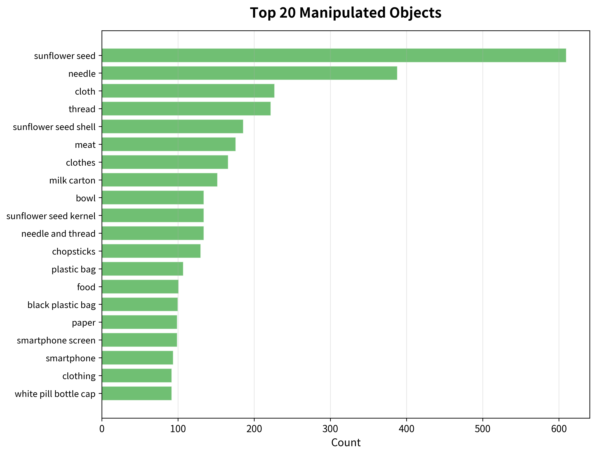

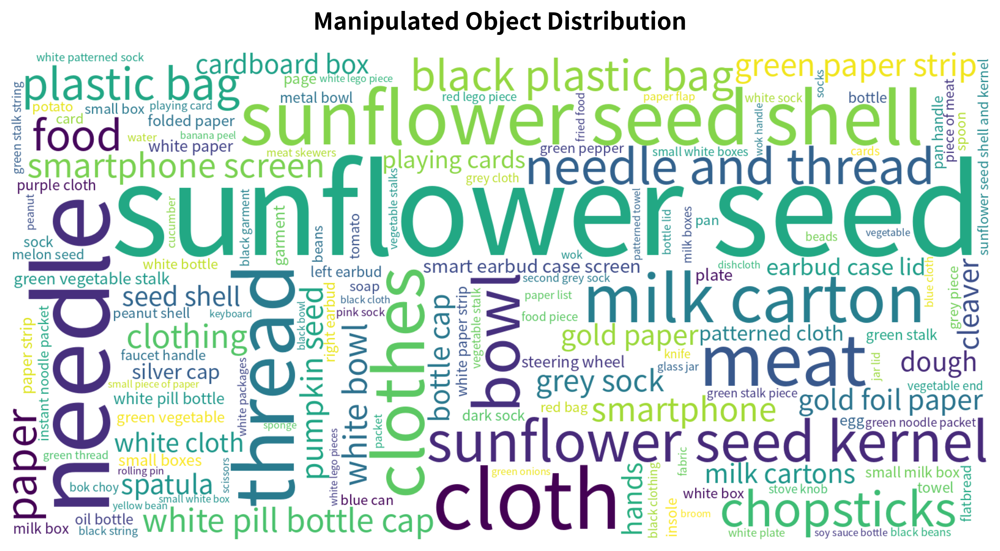

### 现状

1,362 个独立物体标签中，`sunflower seed`（610 次）高居榜首，加上其衍生标签 `sunflower seed shell`（186）和 `sunflower seed kernel`（134），**瓜子相关标签合计 930 次，占总动作的 7.7%**。第二名 `needle`（388）及 `needle and thread`（134）= 522 次。

物体标签也存在碎片化：`cloth / clothes / clothing / garment / white cloth / patterned cloth` 等实质上是同类物体的不同描述。

### 健康度评价：⚠️ 需要优化

- **问题 1 — 单一物体过度集中**："嗑瓜子"场景的 sunflower seed 系列标签占比畸高。这类动作虽然有一定的精细操控价值（双指捏取），但对通用操控能力的代表性不足。
- **问题 2 — 标签粒度不一致**：有些标签非常具体（`white pill bottle cap`），有些非常泛化（`food`），粒度差异会影响物体分类/检测的下游任务。
- **问题 3 — 缺少工具类物体**：螺丝刀、扳手、电钻等典型具身操作工具出现频率极低，与具身智能社区的核心需求不匹配。

### 优化建议

1. 在开源子集中**限制瓜子场景的比例**（如最多保留 100 段），用配额让给更多元的物体
2. 建立**物体标签本体论（ontology）**，定义 2-3 级标签层次（category → instance → attribute）
3. 增补**工具使用场景**（维修、组装、DIY），以及**日用品交互**（开瓶盖、折叠衣物、整理收纳）

---

## 四、采集设备分布

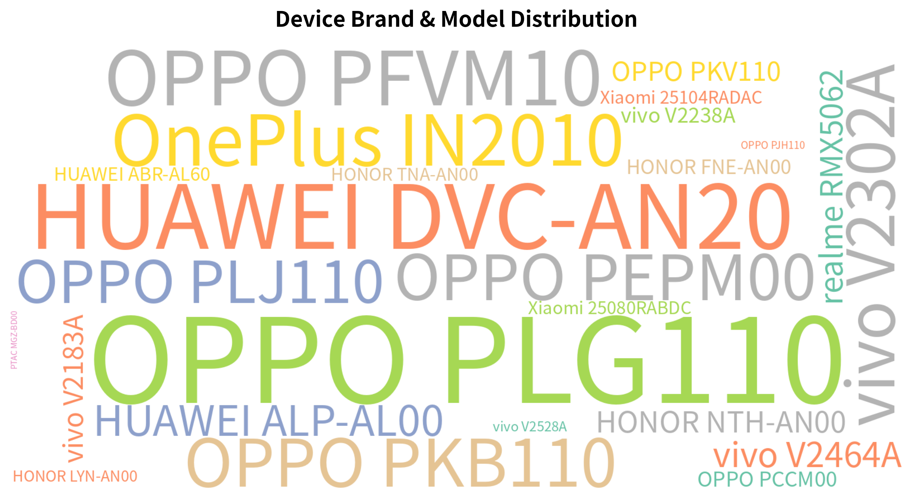

### 现状

25 个设备型号中，**OPPO 品牌占 53.6%**（536/1000），其中 `OPPO PLG110` 单一型号占 24.3%。HUAWEI 占 18%、vivo 12.8%、OnePlus 7.3%、HONOR 4.3%。

| 品牌 | 片段数 | 占比 |
|------|--------|------|
| OPPO | 536 | 53.6% |
| HUAWEI | 180 | 18.0% |
| vivo | 128 | 12.8% |
| OnePlus | 73 | 7.3% |
| HONOR | 43 | 4.3% |
| realme | 25 | 2.5% |
| Xiaomi | 14 | 1.4% |
| PTAC | 1 | 0.1% |

### 健康度评价：⚠️ 需要优化

- **问题 1 — 品牌多样性不足**：仅覆盖国产 Android 品牌，**完全缺少 Apple / Samsung / Google Pixel**。这意味着 iOS 设备的相机特性（色彩管线、畸变模型、HDR 策略）在数据集中零覆盖，会限制模型对不同 ISP 管线的鲁棒性。
- **问题 2 — 单一型号占比过高**：OPPO PLG110 独占 24.3%，可能引入设备特定的视觉偏置（如固定的镜头畸变、色温倾向）。
- **合理之处**：覆盖了 25 个不同型号，FOV 范围 64°-97°，在安卓设备空间内有一定多样性。

### 优化建议

1. 引入 **iPhone / Samsung Galaxy** 系列设备的采集数据，至少各占 10%
2. 在采集任务分配时**按设备型号做配额控制**，避免单一型号过度集中
3. 在 tech report 中明确标注设备覆盖范围的局限性

---

## 五、FOV（视场角）分布

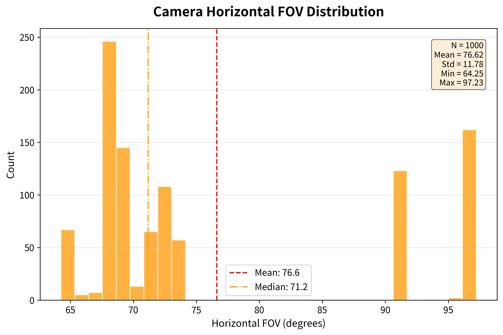

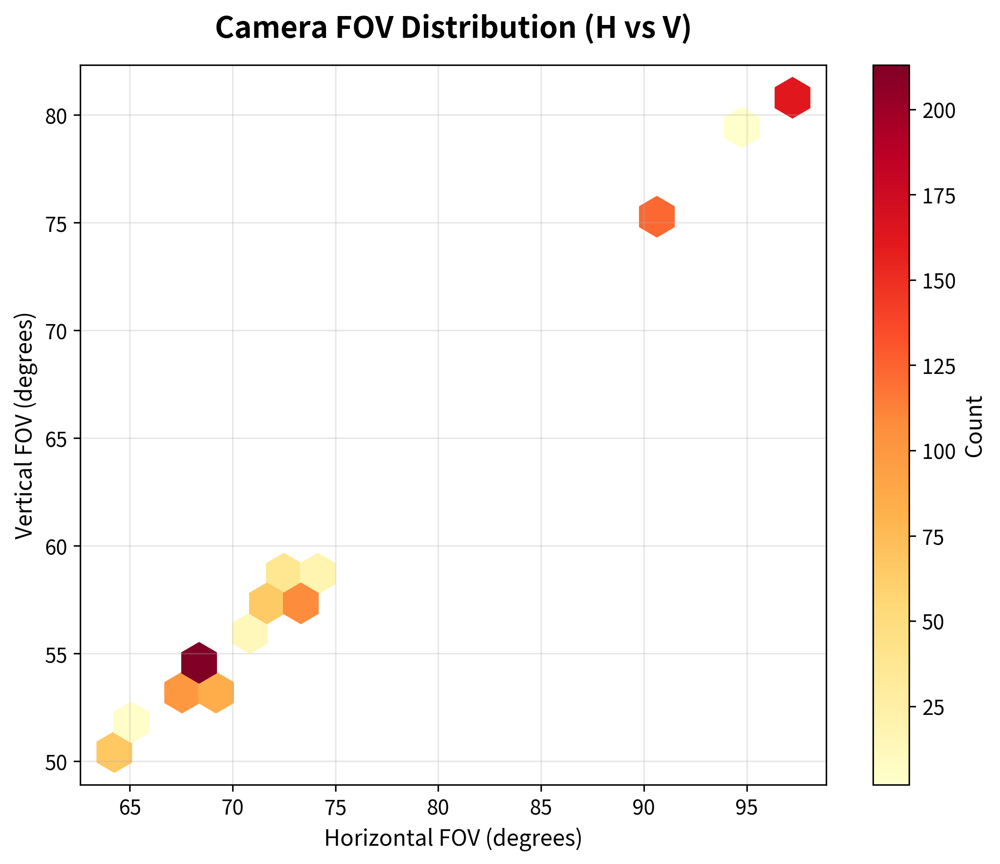

### 现状

水平 FOV 均值 **76.6°**，标准差 11.8°，范围 64.2° – 97.2°。

### 健康度评价：✅ 合理

- FOV 分布范围覆盖了主流手机的典型视场角（65°-100°），均值和方差均在合理区间
- 从 2D 热力图看，H-V FOV 呈现出若干设备对应的聚类中心，这是预期行为（不同手机型号的镜头参数固定）
- 对下游模型来说，FOV 多样性有利于学习到 FOV-invariant 的特征表示

---

## 六、视频参数分布

### 6.1 分辨率

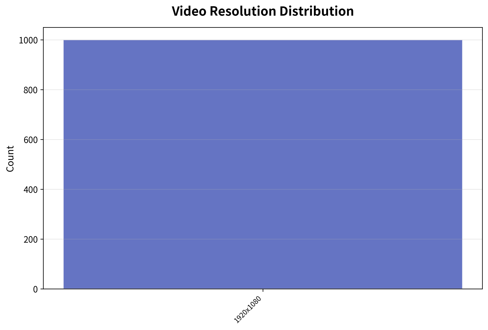

**100% 为 1920×1080（Full HD）**。

**健康度评价：⚠️ 单一，需关注**

- 分辨率完全一致虽然简化了预处理流程，但缺乏 4K / 720p 等不同档位的数据。对于需要多尺度训练的模型可能是短板。
- 不过对于第一版开源数据集而言，统一分辨率可降低使用门槛，可视为合理的工程决策。

### 6.2 帧率

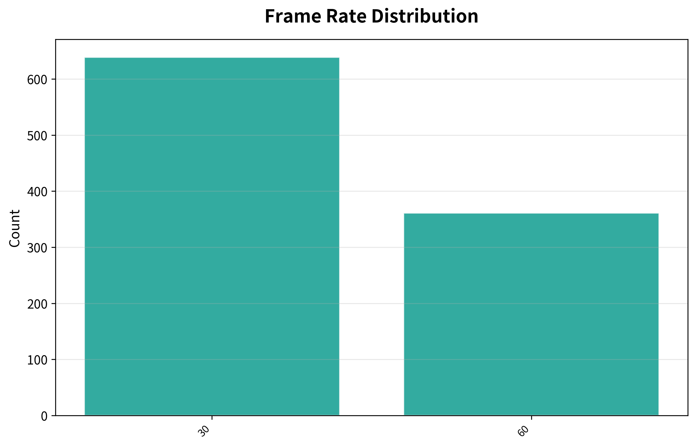

30fps 占 **63.9%**，60fps 占 **36.1%**。

**健康度评价：✅ 合理**

- 30fps 和 60fps 的比例分布合理，覆盖了主流采集设置
- 60fps 数据对高速动作（如翻牌、剥壳）的时序建模有额外价值

### 6.3 时长

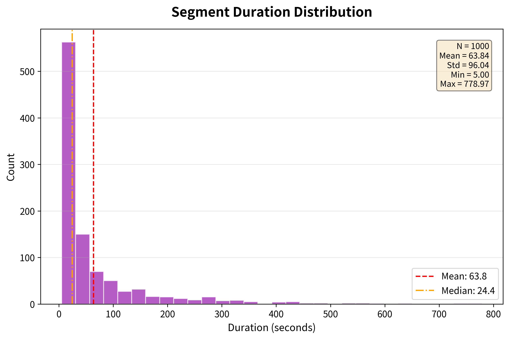

均值 **63.8s**，标准差 96.0s，最短 5s，最长 779s（约 13 分钟）。

**健康度评价：⚠️ 需关注**

- 标准差（96s）大于均值（64s），说明时长分布**严重右偏**：大量短片段 + 少量极长片段
- 极短片段（<10s）的动作标注可能质量偏低（动作不完整）
- 极长片段（>5min）可能包含大量无动作空闲时段，拉低动作密度

### 优化建议

1. 建议在开源筛选时**剔除 <10s 的片段**，或标记为低置信度
2. 对 >300s 的长片段做人工复审，确认动作标注的完整性和密度

---

## 七、手部使用分布

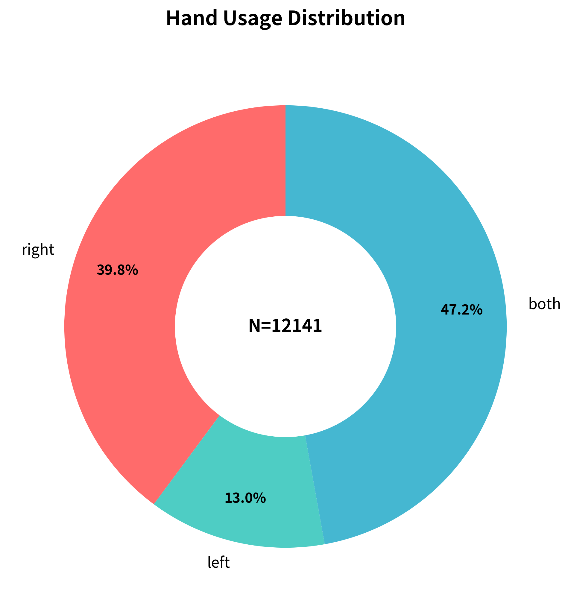

### 现状

| 类型 | 动作数 | 占比 |
|------|--------|------|
| 双手 (both) | 5,726 | 47.2% |
| 右手 (right) | 4,838 | 39.8% |
| 左手 (left) | 1,577 | 13.0% |

### 健康度评价：✅ 良好

- 双手操作占比最高（47.2%），符合真实场景中 bimanual manipulation 的频率
- 右手单手操作（39.8%）显著高于左手（13.0%），与人群中右利手 ~90% 的比例一致
- 三类手部使用均有充足样本，对手部姿态估计和操作策略学习都有价值

---

## 八、动作密度分布

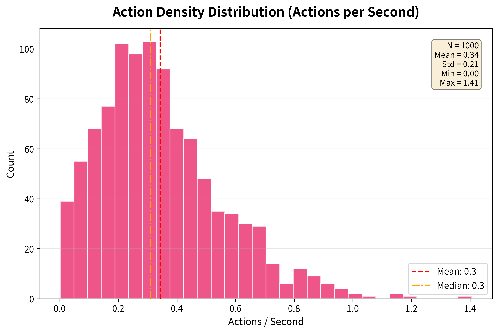

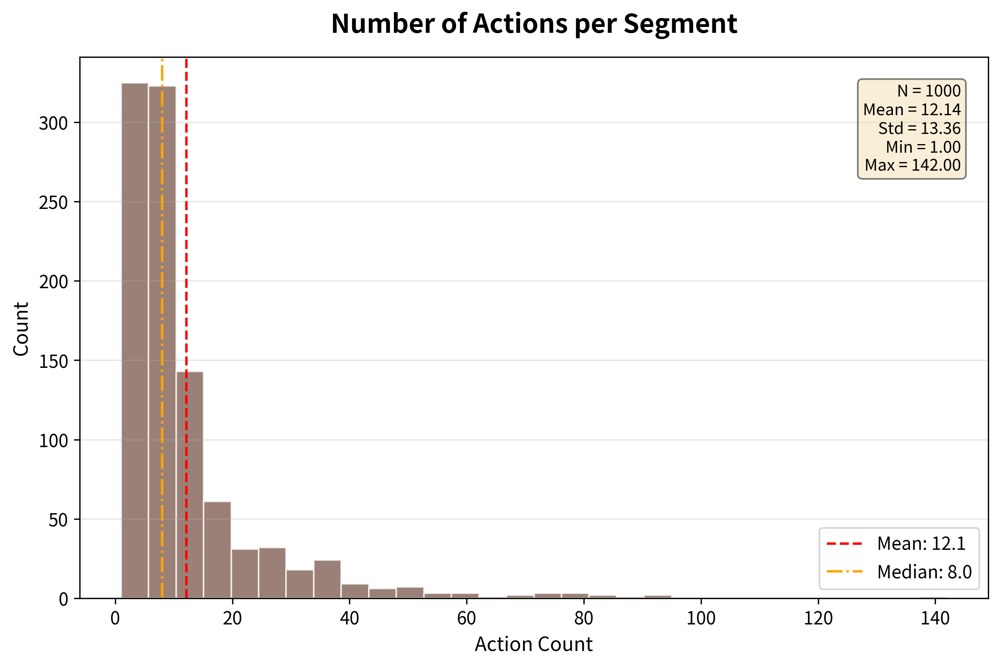

### 现状

平均每段视频包含约 **12.1 个动作**（12,141 / 1,000）。

### 健康度评价：✅ 合理

- 动作密度（actions/sec）分布呈现合理的单峰分布，说明标注节奏整体一致
- 每段动作数量分布覆盖了从简单单步操作到复杂多步任务的范围

---

## 九、采集者贡献分布

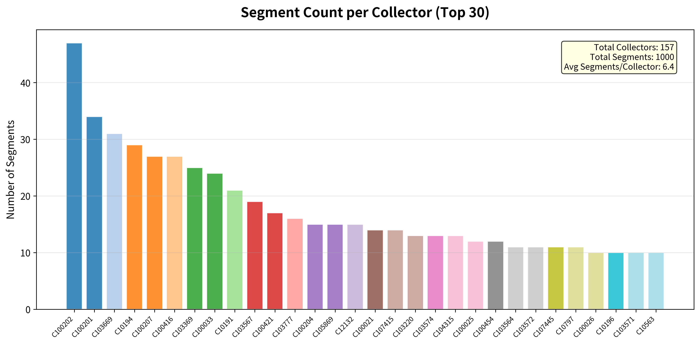

### 现状

157 位采集者共完成 1,000 段采集，人均 **6.4 段**。但分布呈显著长尾：

- **Top 1 采集者（C100202）贡献 46 段（4.6%）**，是人均水平的 7.2 倍
- **Top 3 采集者**（C100202 / C100201 / C103669）合计约 111 段，占 **11.1%**
- **Top 10 采集者**合计贡献约 270+ 段，占总量的 **27%+**
- 大量采集者贡献 ≤5 段，长尾末端存在大量低贡献个体

### 健康度评价：⚠️ 需关注

- **采集者偏置风险明确存在**：Top 1 采集者独占 4.6%，其个人的操作习惯、家庭环境、设备特征会在数据中形成系统性偏置。Top 10 合计 27% 的比重进一步放大了这一风险。
- 157 人的采集者规模在同类数据集中属于中上水平（Ego4D 约 900+，EPIC-KITCHENS ~45，Something-Something 众包模式），但头部集中度偏高。

### 优化建议

1. 在开源子集中对**头部采集者做降采样**：建议单人贡献上限控制在 2%（~20 段），将 C100202 等高贡献采集者的多余配额让给其他采集者
2. 在 tech report 中公开采集者贡献分布的**基尼系数**和 Top-K 集中度指标，增强数据集透明度
3. 下一批采集**扩大采集者基数**，目标 300+ 人，并控制单人上限

---

## 综合评估与优先行动项

### 分布健康度总览

| 维度 | 健康度 | 要点 |
|------|--------|------|
| 场景分布 | ⚠️ 需优化 | kitchen 独大（37.6%），户外仅 3.6%，标签碎片化 |
| 动作动词 | ✅ 基本合理 | 长尾自然，grasp 高频符合预期，scrub 偏高需排查 |
| 被操作物体 | ⚠️ 需优化 | 瓜子系列占比畸高（7.7%），标签粒度不一致，缺工具类物体 |
| 采集设备 | ⚠️ 需优化 | OPPO 占 54%，零 iOS/Samsung 覆盖 |
| FOV | ✅ 合理 | 均值 76.6°，覆盖 64°-97° |
| 分辨率 | ⚠️ 单一 | 100% 为 1080p |
| 帧率 | ✅ 合理 | 30/60fps 比例 64:36 |
| 时长 | ⚠️ 需关注 | 右偏严重，std > mean |
| 手部使用 | ✅ 良好 | 双手/右/左比例自然 |
| 动作密度 | ✅ 合理 | 单峰分布，标注一致 |
| 采集者 | ⚠️ 需关注 | Top 1 占 4.6%，Top 10 占 27%+，头部集中度偏高 |

### 🔴 高优先级行动（开源前必须解决）

1. **场景标签归一化**：合并同义标签（`living room` / `living_room` 等），收敛到标准 taxonomy
2. **物体标签治理**：建立 ontology，统一粒度，合并同义词
3. **瓜子场景降采样**：在开源子集中限制 sunflower seed 相关片段的比例

### 🟡 中优先级行动（下一批采集定向补充）

4. **补充非厨房场景**：workshop / garage / outdoor 场景，目标将 kitchen 占比降至 <25%
5. **补充设备多样性**：引入 iPhone 和 Samsung 设备，OPPO 占比控制在 <30%
6. **补充工具操作场景**：螺丝刀、扳手、电钻等工具使用
7. **时长质量筛选**：剔除 <10s 片段，复审 >300s 片段

### 🟢 低优先级 / 长期改进

8. 引入多分辨率采集（720p / 4K）
9. 公开采集者贡献分布的基尼系数
10. 与 Ego4D / EPIC-KITCHENS 做跨数据集分布对比分析

---

> **结论**：当前数据集在动作动词丰富度、手部使用分布、帧率多样性、动作密度等维度表现良好，具备开源发布的基础质量。核心瓶颈在于**场景和物体分布的头部集中度过高**，以及**采集设备品牌覆盖不足**。建议在开源前完成标签治理和子集采样平衡，并在下一批采集中定向补充弱势维度。
