# POC 数据分布分析报告

> **数据路径**：`/home/woxue/projects/EgoVerse/datasets/poc_deliver`  
> **分析日期**：2026-06-10  
> **有效数据**：110 segments / 1,230 actions / 2.93 hours  
> **排除数据**：1 segment（见附录 A）  
> **统计工具**：`visualize_data_distribution.py --exclude poc_raw_video_20260226_215034_part001`

---

## 总览

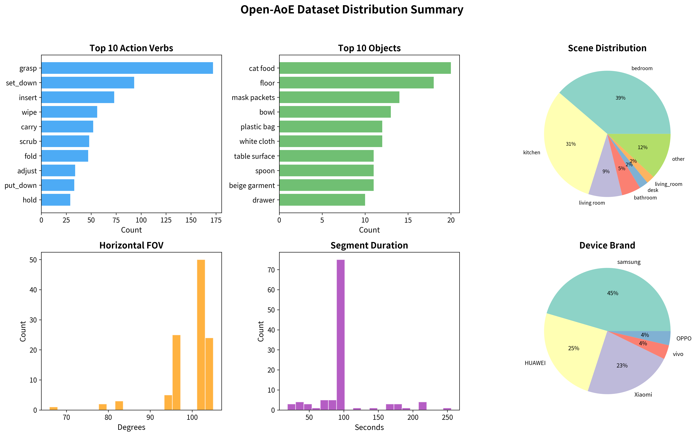

### 核心指标速览

| 指标 | 数值 |
|------|------|
| 有效视频片段数 | 110 |
| 原子动作总数 | 1,230 |
| 总时长 | 2.93 小时 |
| 独立动词数 | 93 |
| 独立物体数 | 587 |
| 场景类别数 | 17（归一化后 15） |
| 采集设备型号数 | 7 |
| 平均每段动作数 | 11.2 |

---

## 一、场景分布

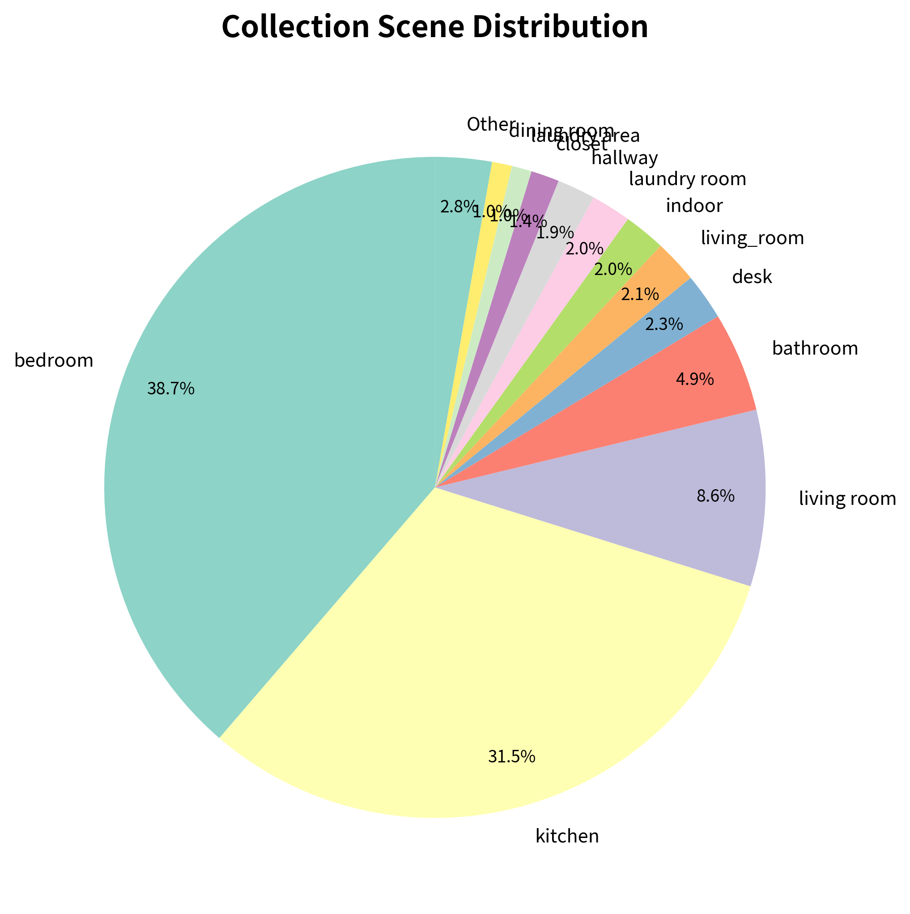

### 现状

17 个场景标签（归一化后 15 类），动作分布集中于 **bedroom（476 次，38.7%）** 和 **kitchen（387 次，31.5%）**，两者合计占 **70.2%**。

| 场景 | 动作数 | 占比 |
|------|--------|------|
| bedroom | 476 | 38.7% |
| kitchen | 387 | 31.5% |
| living room | 132 | 10.7% |
| bathroom | 60 | 4.9% |
| desk | 28 | 2.3% |
| laundry room / area | 45 | 3.7% |
| 其他 7 类 | 102 | 8.3% |

仍存在**标签碎片化**：`living room` / `living_room`、`laundry room` / `laundry_room` / `laundry area` / `laundry` 等多种写法指代同一场景。

### 健康度评价：⚠️ 需要优化

- **问题 1 — 头部双场景占比过高**：bedroom + kitchen 合计 70.2%，模型在其他场景下泛化能力受限。
- **问题 2 — 户外场景零覆盖**：15 个归一化场景全部为室内。
- **问题 3 — 标签碎片化未收敛**：仅 laundry 相关就有 4 种写法。
- **亮点**：相比上一批数据 kitchen 独占 37.6%，POC 将场景重心分散到 bedroom 和 kitchen 两极，living room（10.7%）也有一定比重，**分布比单场景独大更健康**。

### 优化建议

1. 建立统一的**场景标签映射表**，合并同义标签
2. 下一批采集定向增加 **workshop / outdoor / garage** 等场景
3. 两批数据合并后通过采样将单一场景占比控制在 **<25%**

---

## 二、动作动词分布

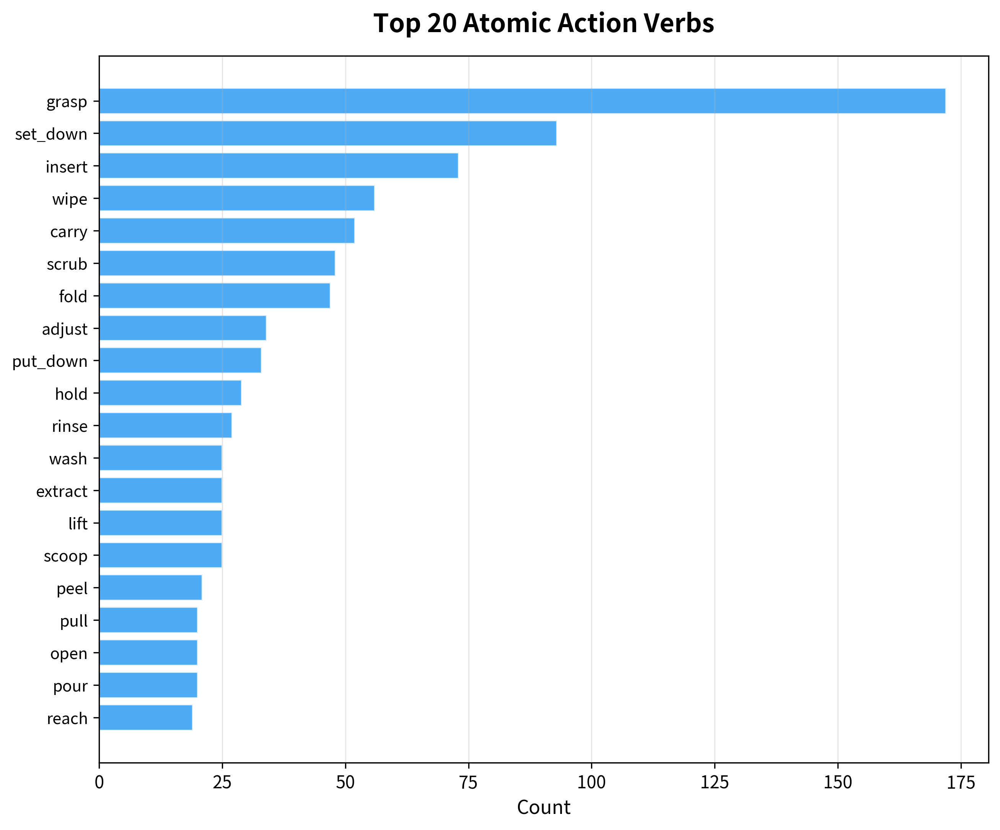

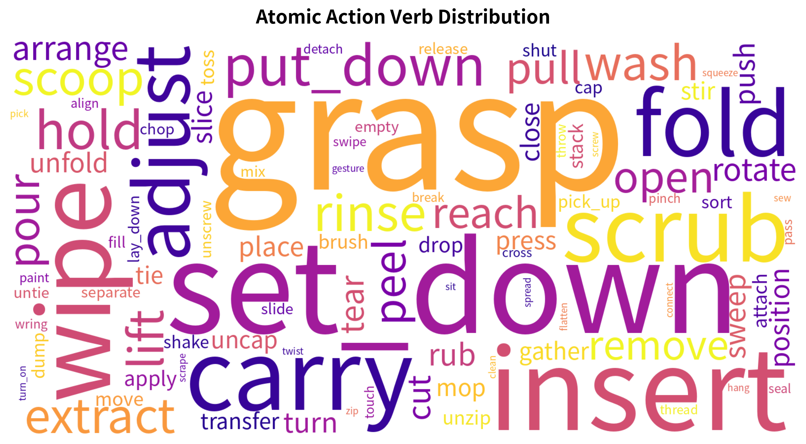

### 现状

93 个独立动词中，`grasp`（172 次）居首，是第二名 `set_down`（93）的 1.8 倍。Top 5（grasp / set_down / insert / wipe / carry）合计 446 次，占 **36.3%**。Top 20 覆盖 **70.2%**。

### 健康度评价：✅ 良好

- **头部集中度合理**：grasp 占 14.0%，作为通用起始动作属正常范围。与第二名的差距 1.8x，分布较均匀。
- **动词多样性优秀**：93 类 / 1,230 动作 = 平均每 13.2 个动作出现一个新动词。
- **新增实用动词**：`open`（20）、`tear`（15）、`sweep`（12）、`mop`（8）、`unzip`（5）、`tie`（8）等丰富了操作词汇表。
- **排除异常数据后 `arrange` 回归正常**：从 100 次降至 16 次，排名从第 2 降至第 22，不再异常。

---

## 三、被操作物体分布

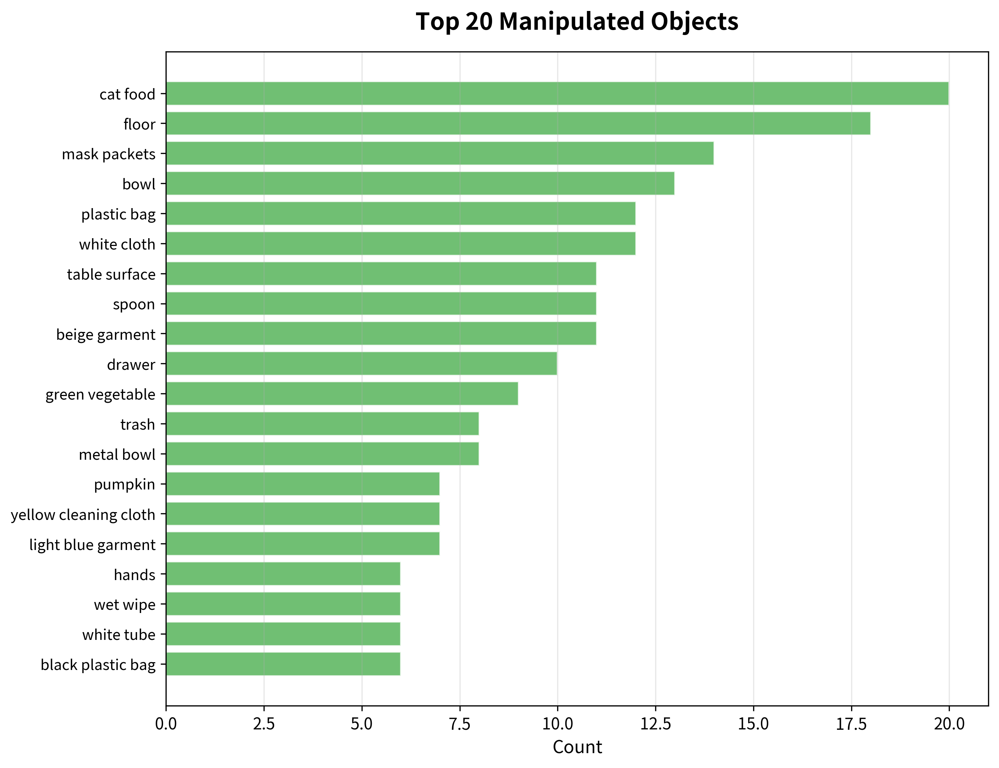

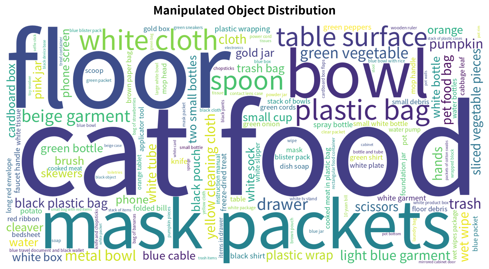

### 现状

587 个独立物体标签中，Top 1 为 `cat food`（20 次，1.6%），其次是 `floor`（18，1.5%）、`mask packets`（14，1.1%）。**排除异常数据后，`tissues`（原 90 次）已不在 Top 50 中**，物体分布不再有单一标签畸高的问题。

Top 20 物体合计约 210 次，仅占总动作的 17.1%，其余 567 个物体共享 82.9%——**长尾极其丰富，无头部集中问题**。

### 健康度评价：✅ 良好

- **亮点 — 物体多样性极高**：587 独立物体 / 110 段 = 平均每段贡献 5.3 个新物体类别。
- **亮点 — Top 1 仅占 1.6%**：这是非常健康的分布，没有任何单一物体主导。
- **日常物品覆盖广泛**：衣物、厨具、清洁工具、食品、收纳用品均有涵盖。
- **关注点**：标签粒度仍不统一（`white cloth` / `cloth` / `yellow cleaning cloth`），需建立 ontology。

---

## 四、采集设备分布

### 现状

| 品牌 | 片段数 | 占比 |
|------|--------|------|
| samsung | 50 | 45.5% |
| HUAWEI | 27 | 24.5% |
| Xiaomi | 25 | 22.7% |
| OPPO | 4 | 3.6% |
| vivo | 4 | 3.6% |

7 个设备型号，以 samsung SM-S9080（50 段）为主。

### 健康度评价：⚠️ 有改善但仍需优化

- **亮点**：三大品牌（samsung 45.5% / HUAWEI 24.5% / Xiaomi 22.7%）形成较好的三足鼎立，比上一批 OPPO 独占 53.6% 更均衡。
- **亮点**：引入 Samsung，填补上一批零覆盖的空白。
- **问题**：仍缺少 **Apple iPhone** 和 **Google Pixel**。samsung SM-S9080 单型号占 45.5%，偏高。

### 优化建议

1. 引入 **iPhone** 设备，至少占 10%
2. 单一型号占比控制在 **<25%**

---

## 五、FOV（视场角）分布

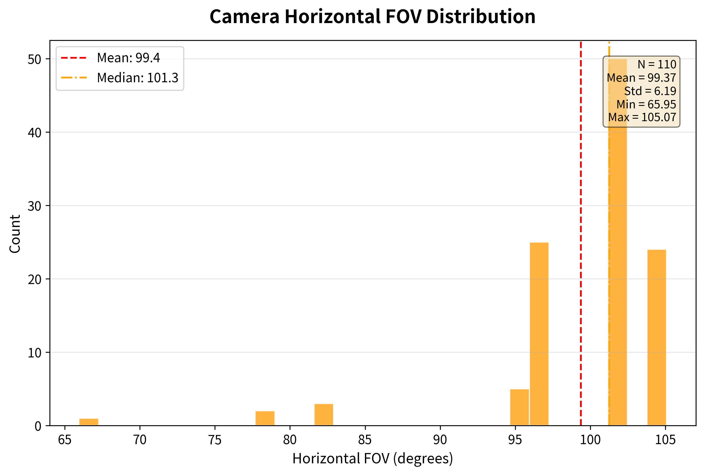

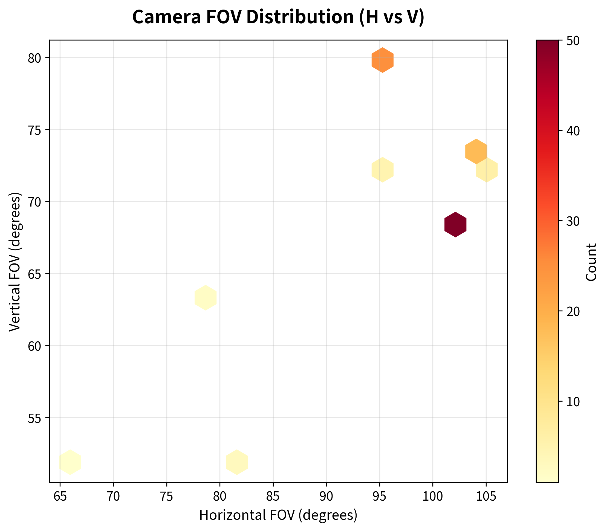

### 现状

水平 FOV 均值 **99.4°**，标准差 6.2°，范围 66.0° – 105.1°。绝大多数集中在 95°-105°，少量在 66°-80°。

### 健康度评价：⚠️ 需关注

- 分布呈双峰但极不均——广角设备（~101°）占压倒性多数。
- 与上一批（均值 76.6°，范围 64°-97°）形成互补，**合并后 FOV 将覆盖 65°-105°**，这是积极信号。
- 70°-90° 中间地带数据稀缺，存在断层。

---

## 六、视频参数分布

### 6.1 分辨率

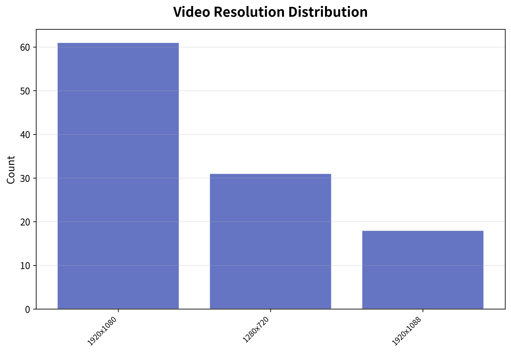

| 分辨率 | 片段数 | 占比 |
|--------|--------|------|
| 1920×1080 | 61 | 55.5% |
| 1280×720 | 31 | 28.2% |
| 1920×1088 | 18 | 16.4% |

**健康度：✅ 有改善** — 引入 720p（28.2%），不再单一。`1920×1088` 为编码对齐变体，实质等同 1080p。

### 6.2 帧率

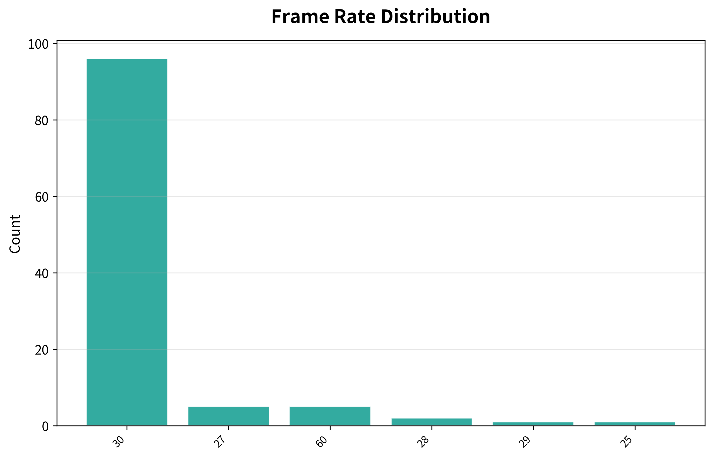

| 帧率 | 片段数 | 占比 |
|------|--------|------|
| 30 fps | 96 | 87.3% |
| 60 fps | 5 | 4.5% |
| 27 fps | 5 | 4.5% |
| 28 fps | 2 | 1.8% |
| 29 fps | 1 | 0.9% |
| 25 fps | 1 | 0.9% |

**健康度：⚠️ 需关注** — 60fps 仅 4.5%（上一批 36.1%），且出现非标准帧率（25/27/28/29fps）共 9 段（8.2%），疑为设备兼容性问题。

### 6.3 时长

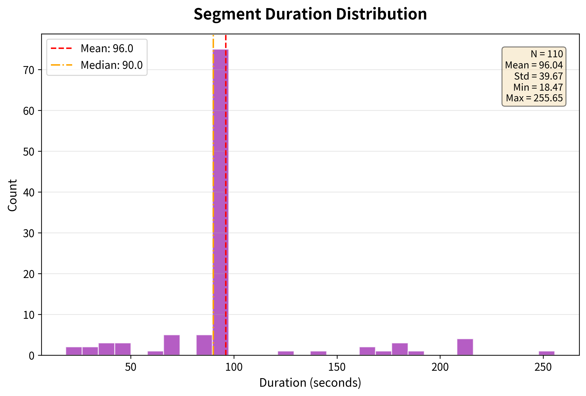

均值 **96.0s**，中位数约 90s，标准差 **39.7s**，最短 18.5s，最长 255.7s。

**健康度：✅ 良好（排除异常后显著改善）**

- std/mean = 0.41，远优于排除前的 2.8，分布合理。
- 绝大多数片段集中在 30-150s 区间，呈温和的右偏分布，符合自然采集特征。
- 无极端异常值。

---

## 七、手部使用分布

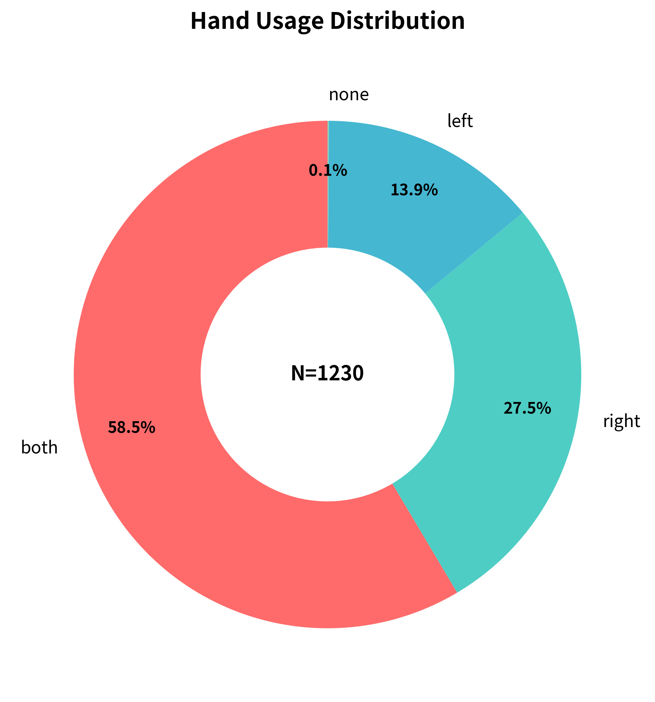

| 类型 | 动作数 | 占比 |
|------|--------|------|
| 双手 (both) | 720 | 58.5% |
| 右手 (right) | 338 | 27.5% |
| 左手 (left) | 171 | 13.9% |
| 无 (none) | 1 | 0.1% |

### 健康度评价：✅ 良好

- 双手操作占 58.5%，符合衣物整理/清洁等 bedroom 场景的双手协作特点。
- 右/左比 2:1，与右利手分布一致。

---

## 八、动作密度分布

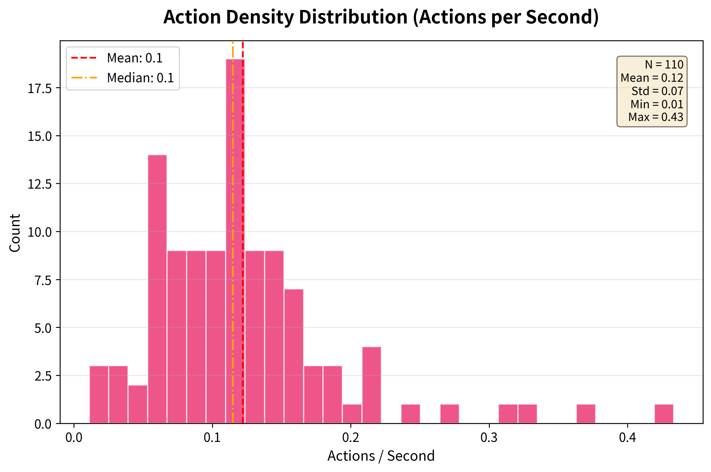

均值 **0.12 actions/s**，中位数 **0.10 actions/s**，标准差 0.07，范围 0.01 – 0.43。

### 健康度评价：⚠️ 需关注

- 分布呈双峰特征（~0.05 和 ~0.10-0.12），说明存在两类不同标注粒度的片段。
- 极低密度（<0.03）片段可能含大量空闲时段；极高密度（>0.3）片段可能存在过度碎片化标注。

---

## 九、采集者贡献分布

POC 数据目录名不含 collector_id，**无法分析采集者多样性**。建议在元数据中补充采集者标识。

---

## 综合评估

### 分布健康度总览

| 维度 | 健康度 | 要点 |
|------|--------|------|
| 场景分布 | ⚠️ 需优化 | bedroom(38.7%)+kitchen(31.5%)=70.2%，户外零覆盖 |
| 动作动词 | ✅ 良好 | 93 类，头部均匀，排除异常后 arrange 回归正常 |
| 被操作物体 | ✅ 良好 | 587 类，Top1 仅占 1.6%，长尾丰富 |
| 采集设备 | ⚠️ 需优化 | 引入 Samsung 是亮点，仍缺 iPhone |
| FOV | ⚠️ 需关注 | 均值 99.4°，与上一批互补但中间带断层 |
| 分辨率 | ✅ 有改善 | 引入 720p（28.2%） |
| 帧率 | ⚠️ 需关注 | 60fps 仅 4.5%，存在非标帧率 |
| 时长 | ✅ 良好 | 排除异常后 std/mean=0.41，无极端值 |
| 手部使用 | ✅ 良好 | 双手 58.5%，分布自然 |
| 动作密度 | ⚠️ 需关注 | 双峰分布 |
| 采集者 | ❌ 数据缺失 | 目录名无 collector_id |

### 🔴 高优先级

1. **场景标签归一化**：合并 `living room`/`living_room`、`laundry room`/`laundry_room`/`laundry area`/`laundry` 等同义标签
2. **排查非标准帧率片段**（25/27/28/29fps 共 9 段）
3. **补充采集者标识**

### 🟡 中优先级

4. 下一批补充 **户外/工业场景**
5. 引入 **iPhone** 设备，控制单型号占比 <25%
6. 提升 **60fps** 采集比例（目标 >20%）

### 🟢 低优先级

7. 补充 70°-90° FOV 区间数据
8. 物体标签 ontology 建设

---

## 附录 A：排除数据记录

### `poc_raw_video_20260226_215034_part001`

| 项目 | 详情 |
|------|------|
| **问题类型** | 标注时间戳错误 |
| **视频实际时长** | 141.7s（ffprobe 确认） |
| **标注 max(end_ts)** | 3900.0s（异常，为视频时长的 27.5 倍） |
| **标注条目数** | 108 条 |
| **异常表现** | id 1-14 时间戳正常（0-180s）；id 15 起以固定 40s 间隔线性递增至 3900s；id 26-107 连续 82 条标注全为 `arrange` 动词；最后一条 id 108 的 end_ts 突然回落至 141.66s |
| **根因分析** | 标注工具的时间戳未对齐视频时间轴，从 id 15 开始时间戳累加而非映射到实际帧。82 条重复 `arrange` 表明标注流程可能在时间戳溢出后进入了机械填充模式 |
| **数据影响** | 若不排除：inflate `arrange` 从 16→100 次（虚增 84 次），inflate 时长均值从 96s→130s（std 从 39.7s→361.6s），污染动词分布和时长分布两个维度 |
| **处置** | 本报告统计中已排除。建议修复标注后重新纳入，或彻底剔除 |

---

> **结论**：排除 1 条异常标注数据后，POC 批次在**动词多样性（93 类）、物体丰富度（587 类，Top1 仅 1.6%）、时长分布（std/mean=0.41）、手部使用分布**等维度均表现良好。核心瓶颈为 **bedroom+kitchen 双场景合占 70.2%、户外场景零覆盖、采集者信息缺失**。建议优先进行标签治理和元数据补全，并在下一批采集中定向补充弱势维度。
