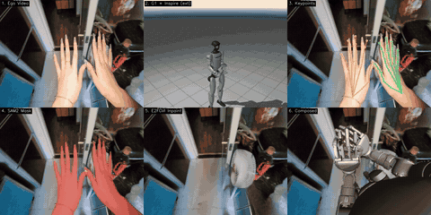
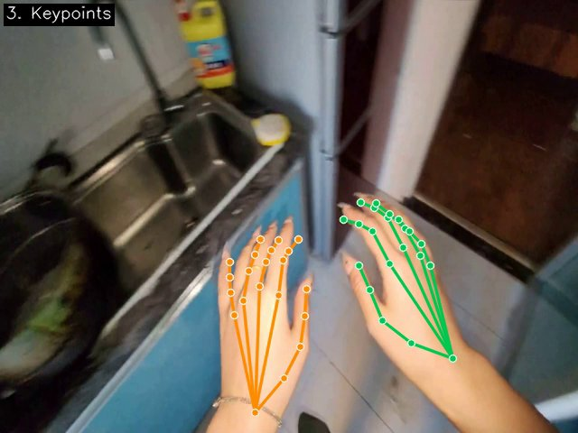
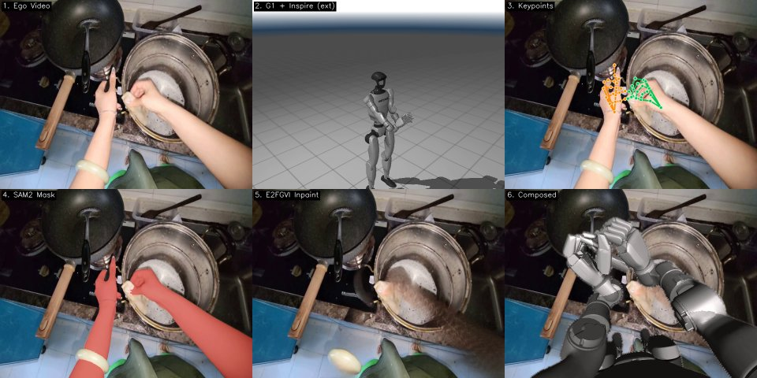

# Phantom

Human-to-Robot 运动重映射工具，将 AoE ego-centric 数据（手机录制 + MANO 双手重建）转换为 Unitree G1 机器人可执行的关节轨迹。

<p align="center">
  
</p>
<p align="center"><em>完整 2×3 可视化管线：手机 ego 视频 → MANO 关键点 → SAM2 分割 → E2FGVI 修复 → G1 机械臂合成</em></p>

## 架构

```
Layer 1: 数据预处理     — MANO FK (world→cam) 生成 21 关键点 sidecar → 统一 episode 表示
Layer 2: 运动学重映射   — 臂部 IK (mink 7-DoF/臂) + 手指 (dex-retargeting)
Layer 3: 仿真验证       — MuJoCo 2×3 可视化 + FK keypoints overlay
Layer 4: 视频合成       — SAM2 手部分割 (FK seed) + E2FGVI 修复 + 边缘融合合成
Layer 5: 真机 Replay    — Unitree G1 + Inspire Hand SDK (Phase 2+)
```

## 支持的机器人

| Robot | Action Dim | Layout | Hand |
|-------|-----------|--------|------|
| G1 + Inspire | 26 | `[L_arm(7), R_arm(7), L_hand(6), R_hand(6)]` | 5 指，6 actuated + 6 mimic |
| G1 + Dex3 | 28 | `[L_arm(7), R_arm(7), L_hand(7), R_hand(7)]` | 3 指，7 actuated |

## 快速开始

### 安装

```bash
# 使用已有的 phantom conda 环境（包含所有依赖）
conda activate phantom

# 或从头安装依赖
cd release/aoe-retarget-replay/phantom
pip install -e .
```

### 单 episode 重映射

```bash
cd release/aoe-retarget-replay/phantom

# Inspire (26-DoF, 5 指)
MUJOCO_GL=egl python scripts/retarget.py \
    --episode_dir /path/to/poc_raw_video_20260131_193028 \
    --robot g1_inspire \
    --output_dir ./output/inspire \
    --visualize

# Dex3 (28-DoF, 3 指)
MUJOCO_GL=egl python scripts/retarget.py \
    --episode_dir /path/to/poc_raw_video_20260131_193028 \
    --robot g1_dex3 \
    --output_dir ./output/dex3 \
    --visualize
```

### 批量处理

```bash
MUJOCO_GL=egl python scripts/retarget.py \
    --data_root /mnt/20T-1/yifan/data/poc_deliver \
    --robot g1_inspire \
    --output_dir ./output/batch_inspire \
    --write_parquet \
    --skip_existing
```

### 可视化（2×3 布局）

```bash
# 仅 retarget + MuJoCo 可视化（无 Stage 3）
MUJOCO_GL=egl python scripts/visualize.py \
    --episode_dir /path/to/segment \
    --robot g1_inspire \
    --output viz_2x3.mp4

# 完整 Stage 3（SAM2 分割 + E2FGVI 修复 + 合成）
MUJOCO_GL=egl python scripts/visualize.py \
    --episode_dir /path/to/segment \
    --robot g1_inspire \
    --stage3 \
    --output viz_2x3_full.mp4
```

输出布局（2×3 grid，每格 640×480）：
```
+-------------------+-------------------+-------------------+
| 1. Ego Video      | 2. Robot (ext)    | 3. Keypoints      |
| (原始去畸变视频)    | (MuJoCo 3/4视角)  | (FK 关键点叠加)   |
+-------------------+-------------------+-------------------+
| 4. SAM2 Mask      | 5. E2FGVI Inpaint | 6. Composed       |
| (手部分割红色叠加)  | (手部移除+修复)    | (机器人替换合成)   |
+-------------------+-------------------+-------------------+
```

<table>
<tr>
<td width="55%"></td>
<td width="45%"></td>
</tr>
<tr>
<td align="center"><em>MANO FK 21 关键点骨架精确覆盖双手</em></td>
<td align="center"><em>厨房操作场景：retarget + 合成</em></td>
</tr>
</table>

## 数据格式要求

输入数据需遵循 `poc_deliver` 目录结构：

```
poc_raw_video_YYYYMMDD_HHMMSS[_partXXX]/
├── raw_video.mp4
├── video_info.json
├── ego_annotation/
│   └── ego_action_annotation.json
└── ego_process/
    ├── ego_hands_reconstruction/
    │   ├── hands.npz              ← MANO 参数（必需）
    │   ├── hands_keypoints.npz    ← 自动生成的 sidecar
    │   └── camera_traj.npz
    └── ego_undistorted_video/
        └── raw_video_undistorted.mp4
```

`hands_keypoints.npz` 如果不存在，会自动通过内置 MANO FK 生成（需要 ~1 秒/episode on GPU）。

> **重要**：cam-space 关键点通过 world-space FK + `R_w2c`/`t_w2c` 变换生成，
> 而非直接用 `pred_rot_cam`/`pred_trans_cam` 做 FK。
> 后者因 MANO LBS 旋转中心在 `J_root` 而非原点，会引入 `(I − R_w2c) · J_root` 偏移。

## 核心依赖

| 包 | 用途 |
|----|------|
| `mujoco` ≥3.0 | IK 求解 + MuJoCo 可视化 |
| `mink` | 7-DoF 臂 IK (proxqp solver) |
| `dex_retargeting` | 手指关键点 → 关节角 |
| `numpy`, `scipy` | 数值计算、旋转变换 |
| `pandas`, `pyarrow` | LeRobot parquet I/O |
| `torch` | MANO FK sidecar 生成 |
| `opencv-python`, `imageio` | 视频 I/O |

## 关键技术参数

| 参数 | 值 |
|------|-----|
| IK solver | mink (proxqp backend) |
| IK 迭代 | 首帧 80 次，后续 10 次/帧 |
| 手指 retarget | dex-retargeting (pinocchio position optimizer) |
| 坐标系 | cam-local (默认，避免 SLAM 漂移) |
| Arm length scaling | 95th percentile, episode-level |
| 输出格式 | `.npy` (action) + LeRobot v2.1 parquet (可选) |
| 帧率 | 30 FPS |

## 已知限制

1. **MANO 推理误差**：上游 HaWoR 模型偶有不准的 wrist 朝向，导致 G1 手腕上翘。这是上游问题，非本工具链 retarget 逻辑错误。
2. **Shoulder 先验是固定的**：cam-local 偏移 `[0, -0.20, -0.05]` 基于人体平均值。极端体型用户可加 `--no_refine_shoulder` 关闭自适应。
3. **Scale 为 episode 级单标量**：不做 per-frame per-arm 缩放。
4. **相机内参**：从 `undistorted_video_info.json` 读取 `fx_pixels/fy_pixels/cx_pixels/cy_pixels` 和 `resolution`。如缺失则回退到 `hands.npz` 中的 `focal` + 视频实际分辨率。

## 推荐升级路径

- **Phase 1 (当前)**: 现有 IK + MuJoCo 可视化 ✅
- **Phase 2**: 集成 GMR 做全身 retarget
- **Phase 3**: 集成 SPIDER 做物理可行性验证

## 项目结构

```
phantom/
├── phantom/                      # Python 包
│   ├── constants/                # 常量定义
│   │   ├── __init__.py           # 共享常量（IK参数、坐标系等）
│   │   ├── aoe.py               # AoE 特有常量（cam→G1 旋转、T_ALIGN）
│   │   ├── g1_dex3.py           # Dex3 28D 布局
│   │   └── g1_inspire.py        # Inspire 26D 布局 + mimic rules
│   ├── robots/                   # 机器人规格注册
│   │   ├── __init__.py           # RobotSpec dataclass + registry
│   │   ├── mjcf_patch.py        # MJCF 相机注入
│   │   ├── g1_dex3.py           # Dex3 spec
│   │   └── g1_inspire.py        # Inspire spec
│   ├── retarget/                 # 重映射核心
│   │   ├── arm_ik.py            # G1 7-DoF 臂 IK (mink)
│   │   ├── hand_retarget_base.py # 手指 retarget 基类
│   │   ├── hand_retarget_dex3.py
│   │   ├── hand_retarget_inspire.py
│   │   └── visualize.py         # MuJoCo 可视化（流式写入，低内存）
│   ├── aoe/                      # AoE 数据适配层
│   │   ├── episode.py           # Episode 加载 + 自动 MANO FK
│   │   ├── shoulder.py          # Cam-local shoulder 合成
│   │   └── transform.py         # AOE cam → G1 base 坐标变换
│   ├── io/                       # LeRobot v2.1 writer
│   └── pipeline.py              # 一站式编排器
├── scripts/
│   ├── retarget.py              # CLI: 重映射
│   └── visualize.py             # CLI: 可视化
├── assets/
│   ├── robots/                   # MJCF + URDF + mesh (~32MB)
│   └── mano_models/             # MANO_LEFT.pkl, MANO_RIGHT.pkl (~7MB)
├── configs/retarget/             # dex-retargeting YAML
└── pyproject.toml
```

## 当前状态

Phase 1 核心完成，已验证：
- ✅ poc_deliver 格式 111 segment 兼容
- ✅ G1 + Inspire (26-DoF) retarget + 可视化
- ✅ G1 + Dex3 (28-DoF) retarget + 可视化
- ✅ 自动 MANO FK sidecar 生成（world→cam 正确变换）
- ✅ 长 segment (5000 帧) 流式处理，无 OOM
- ✅ LeRobot v2.1 parquet 输出
- ✅ 2×3 布局可视化（含 FK keypoints overlay）
- ✅ Stage 3 完整管线（SAM2 双手分割 + E2FGVI 修复 + 边缘融合合成）

详见 [PROJECT.md](../../PROJECT.md) WP3。